# オシロスコープ機能 調査・差分レポート（出典付き）

本ソフト（取込済みCSV/波形の**ソフト解析ツール**）が「高級オシロにありそうな機能を網羅している」という主張に根拠が無かったため、実機オシロの機能を**ベンダー公式の一次資料**で調べ、差分を厳密に示す。実装はしない（監査・マトリクス・差分・既存アルゴリズム検証点まで）。

調査方法：5方向に検索を展開→公式データシート/プログラマガイド/KB を26件取得→124の検証可能クレームを抽出→各クレームを3票の反証検証（2/3で棄却）。**22クレームが3-0の全会一致で確定**、3クレームは棄却して本レポートから除外。

---

## 0. 結論（重要）

- **「高級オシロの機能を網羅」という主張は、SW（ソフト再現可能）機能に限っても成立しない。** 実機にあって本ソフトに無い/部分的なSW機能が多数確定した（§3・§4）。
- 一方で、**本ソフトの“基本測定”は実機の標準定義とほぼ一致**しており、複数ベンダーの式で検証材料が揃った（§5a）。つまり「基本は正しいが、網羅ではない」が正確な評価。
- ただし**THD/SNR/SINAD/ENOB/SFDR の標準定義式**は、確認した実機データシートには明示されておらず（IEEE 1241/1057 等の別出典が必要）、本ソフトの比率指標の式照合は未充足（§5a・§6）。

---

## 図解：主要な測定機能はどういうものか（やさしい説明）

専門用語が多いので、各測定が「波形のどこを測っているか」を図で示す。

### A. 基本の波形測定

**① 振幅系（Top / Base / 振幅 / オーバーシュート 等）**

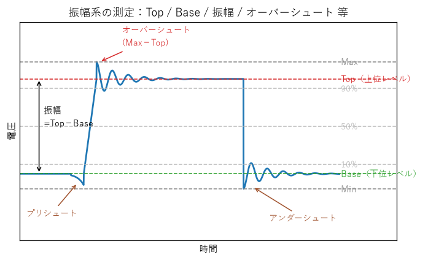

- **Top / Base**：信号の「上の安定レベル」「下の安定レベル」。ノイズの最大/最小ではなく、よく居る電圧（最頻値）で決める。
- **振幅** = Top − Base。
- **オーバーシュート**：エッジ直後に Top を行き過ぎる量（リンギング）。**アンダーシュート**は下側、**プリシュート**はエッジの直前のへこみ。
- → 本ソフトは Top/Base/振幅/オーバーシュート/アンダーシュートを保有（**プリシュートは無し**）。

**② 時間系（周期 / パルス幅 / デューティ / 立上り・立下り）**

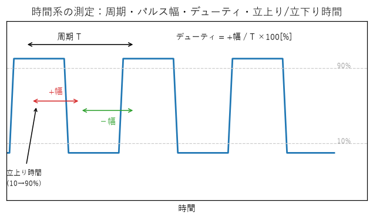

- **周期 T**：1サイクルの長さ。周波数 = 1/T。
- **+幅 / −幅**：High でいる時間 / Low でいる時間。**デューティ** = +幅 / T ×100[%]。
- **立上り時間**：振幅の **10%→90%** に上がるのにかかる時間（立下りは 90%→10%）。実機は閾値を 20-80% や任意%に変えられるが、本ソフトは **10-90% 固定**。

### B. 信号品質（FFTの指標）

**③ THD / SNR / SINAD / ENOB / SFDR**

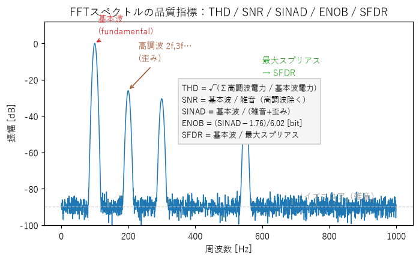

波形をFFTすると、**基本波（本来の信号）** のほかに **高調波（2倍・3倍…の歪み）** や **ノイズ** が見える。その大小関係から品質を数値化する：
- **THD**：歪み（高調波）が基本波に対しどれだけあるか。小さいほど綺麗。
- **SNR**：信号 ÷ 雑音。**SINAD**：信号 ÷ (雑音＋歪み)。
- **ENOB**：SINAD から逆算した「実効ビット数」。**SFDR**：基本波と最大スプリアス（最も目立つ余計な山）の差。
- → 本ソフトは全部保有。ただし**標準定義式の一次規格(IEEE)照合は未完**（§5a）。

### C. 高速信号（シリアル/SI）の測定

**④ アイダイアグラムと構造化アイ測定**

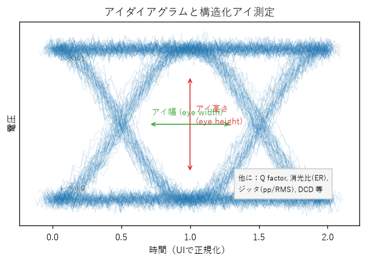

連続したビットを1ビット幅で重ね描きすると「目（アイ）」の形になる。開き具合が信号の良さを表す：
- **アイ高さ**（縦の開き＝レベル余裕）、**アイ幅**（横の開き＝タイミング余裕）。
- ほかに **Q factor / 消光比(ER) / ジッタ(pp・RMS) / DCD** などを数値で出す。
- → 本ソフトは**アイの“表示”はあるが、これらの測定値は無し**（不足機能）。

**⑤ ジッタ TIE（タイムインターバルエラー）**

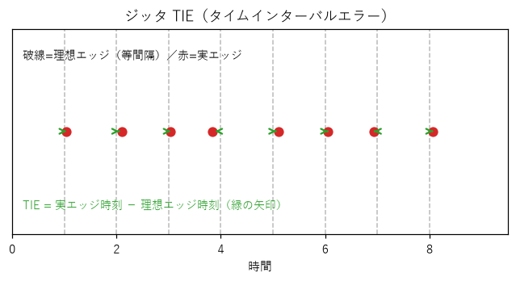

理想なら等間隔に来るはずのエッジが、実際は少し前後にズレる。その**ズレ量＝TIE**。これを集めると揺らぎ（ジッタ）の大きさが分かる。
- → 本ソフトは TIE を保有。**RJ/DJ分離（ランダム/確定性ジッタ）・bathtub曲線は無し**。

**⑥ セットアップ / ホールド時間**

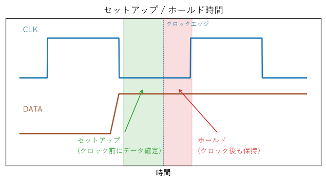

デジタル回路で「クロックのエッジの**前**にデータが確定していないといけない時間＝セットアップ」「エッジの**後**も保持すべき時間＝ホールド」。
- → 本ソフトには無し（不足機能）。

**⑦ スルーレート**

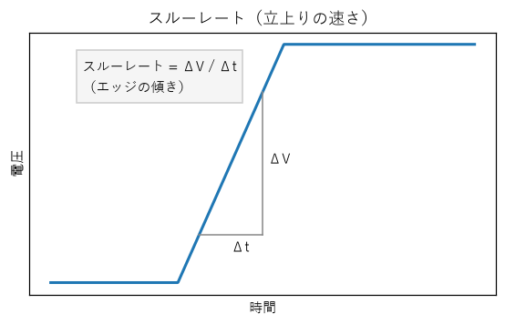

エッジの**傾き** = ΔV / Δt。電圧がどれだけ速く変化できるか。
- → 本ソフトには無し（不足機能）。

### D. ヒストグラム由来

**⑧ ヒストグラム法による Top / Base**

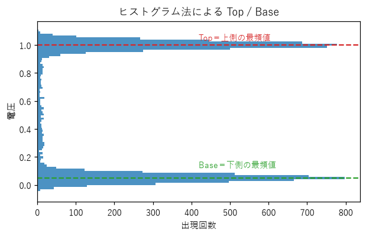

電圧の出現回数を縦に積むと、High と Low の2つの山ができる。**上の山＝Top、下の山＝Base**。最大/最小よりノイズに強い。実機はこのヒストグラムから **HITS/MEDian/PEAKHits/SIGMA1-3** 等も測る（本ソフトは Top/Base と単一σのみ）。

---

## 1. 調査した機種・出典一覧（公式リンク）

| ベンダー | 機種/資料 | クラス | 一次出典URL |
|---|---|---|---|
| Keysight | InfiniiVision 4000 X-Series（Programmer's Guide） | 中級ベンチ | https://www.keysight.com/us/en/assets/9023-40025/miscellaneous/4k_X-Series_prog_guide.pdf |
| Keysight | InfiniiVision 3000T X-Series（Datasheet 5992-0140） | 中級ベンチ | https://www.keysight.com/us/en/assets/7018-04570/data-sheets/5992-0140.pdf ※JSゲートで本文取得不可 |
| Tektronix | 4 Series B MSO（Datasheet） | 高級ベンチ | https://www.tek.com/en/datasheet/4-series-b-mso-mixed-signal-oscilloscope-datasheet |
| Tektronix | MDO4000/MSO4000B/DPO4000B（Programmer Manual） | 中〜高級 | https://download.tek.com/manual/MDO4000-MSO4000B-and-DPO4000B-Oscilloscope-Programmer-Manual.pdf |
| Tektronix | TBS2000（Programmer） | 入門 | https://download.tek.com/manual/TBS2000-Programmer-077114902.pdf |
| Tektronix | DPOJET（Jitter/Noise/Eye 解析ソリューション） | SIオプション | https://www.tek.com/en/datasheet/jitter-noise-and-eye-diagram-analysis-solution |
| Rohde & Schwarz | RTO6（Datasheet） | 高級 | https://assets-us-01.kc-usercontent.com/ecb176a6-5a2e-0000-8943-84491e5fc8d1/7fa25bd7-4467-45b6-b186-501282ad5c44/RS-RTO6_datasheet.pdf |
| Teledyne LeCroy | HDO8000（Datasheet） | 高級 | https://cdn.teledynelecroy.com/files/pdf/hdo8000_oscilloscope_datasheet.pdf |
| Teledyne LeCroy | SDA III ジッタ計算法（Whitepaper） | アルゴリズム | https://cdn.teledynelecroy.com/files/whitepapers/understanding_sdaiii_jitter_calculation_methods.pdf |
| Siglent | SDS2000X HD（Datasheet） | 中級 | https://int.siglent.com/u_file/download/26_04_02/SDS2000X%20HD_Datasheet_EN02B.pdf ※現在404、内容はEU/Welectron公式ミラーで逐語確認済 |
| Keysight | FlexDCA ジッタアルゴリズム（Help） | アルゴリズム | https://helpfiles.keysight.com/scopes/FlexDCA-UG/Content/Topics/Jitter-Mode/Theory/d_jitter_algorithm.htm |
| PicoTech | PicoScope 7 測定（Knowledge Base） | 入門〜中級 | https://www.picotech.com/library/knowledge-bases/oscilloscopes/measurements |
| IEEE | Std 181（Transitions, Pulses, Related Waveforms） | 規格 | https://ieeexplore.ieee.org/document/29013 |
| NI | Oscilloscope/Digitizer 仕様解説 | 規格解説 | https://www.ni.com/en/support/documentation/supplemental/17/specifications-explained--ni-oscilloscopes-and-digitizers.html |

> 限界：「できる限り多数」の指示に対し、**一次出典で深く検証できたのは上記の主要6ベンダー・代表機種**。Rigol/GW Instek/Yokogawa(DLM) は本検証では未到達（追加調査の候補、§6）。

---

## 2. 各機種の主な機能（出典＋位置）

- **Keysight InfiniiVision 4000X**（Programmer's Guide）
  - 自動測定 `:MEASure` サブシステム（VTOP/VBASe/VAMPlitude/OVERshoot/PREShoot/RISetime/FALLtime/DUTYcycle/FREQuency/PERiod/PHASe/VAVerage/VRMS 等）。
  - 閾値定義 `:MEASure:DEFine THResholds` 既定10/50/90%、`PERCent`で5〜95%可変（p.~481 近傍）。
  - FFT窓 `:FUNCtion<m>[:FFT]:WINDow {RECTangular|HANNing|FLATtop|BHARris}`（p.385、HANNing既定）。
- **Tektronix MDO4000/MSO4000B/DPO4000B**（Programmer Manual）
  - `MEASUrement:MEAS<x>:TYPe` に**37種**を逐語列挙（AMPlitude…HITS/MEDian/PEAKHits/SIGMA1|2|3/STDdev/WAVEFORMS 等のヒストグラムボックス由来測定を含む）。
  - 数式 `MATH:TYPe {DUAL|FFT|ADVanced|SPECTRUM}`、`ADVanced`は**最大128文字**の数式（例 `:MATH:DEFINE "SINE(CH1)*(VAR1+CH2)*CH3 - CAREA(CH4)"`）、`MATHVAR:VAR<x>`で名前付き変数。
- **R&S RTO6**（Datasheet p.14–17）
  - 振幅/時間測定に burst width / positive・negative switching / cycle area / cycle mean / cycle RMS / cycle sigma / setup・hold time / setup・hold ratio / pulse train / slew rate rising・falling を列挙。
  - **構造化アイ測定**：extinction ratio, eye height, eye width, eye top/base, Q factor, S/N ratio, duty cycle distortion, eye rise/fall time, eye bit rate, eye amplitude, jitter (peak-to-peak, 6-sigma, RMS)。
  - **波形math**：add/sub/mul/div/abs/square/sqrt/integrate/differentiate/exp/log10/loge/log2/rescale/sin/cos/tan/arcsin/arccos/arctan/sinh/cosh/tanh/autocorrelation/crosscorrelation、論理演算、周波数領域(magnitude/phase/real/imaginary/group delay)、digital lowpass/highpass、ユーザ定義式。
  - **スペクトル**：channel power, occupied bandwidth, harmonic search, THD(dB/%, パワー値ベース), THDa/THDu/THDr(電圧, K37オプション)。
- **Teledyne LeCroy HDO8000**（Datasheet p.17）
  - **任意12パラメータの統計（average/high/low/standard deviation）＋ Parameter Math（2パラメータの加減乗除）**、各インスタンスを統計に追加。
  - 測定：Cycle-Cycle Jitter, TIE@level, Setup, Hold, Skew, Duty Cycle@level, Duty Cycle Error, Risetime(10-90/20-80/@level), Falltime(90-10/80-20/@level), Median 等。
  - math演算子：Correlation, Deskew(resample), Envelope, Enhanced resolution(〜15bit), Interpolate(cubic/quadratic/sinx/x), Average 等。
- **Siglent SDS2000X HD**（Datasheet p.6,13）
  - **50+自動測定**を4カテゴリ（horizontal/vertical/miscellaneous/CH delay）。
  - 垂直19項目：Max/Min/Pk-Pk/Top/Base/Amplitude/Mean/**Cycle Mean**/Stdev/**Cycle Stdev**/RMS/**Cycle RMS**/**Median**/**Cycle Median**/**FOV/FPRE/ROV/RPRE**/**Level@Trigger**。
  - FFT：窓 Rectangular/Blackman/Hanning/Hamming/Flattop、長さ 2k〜2Mpts(11段)、Normal/Max hold/Average、Peaks/Markers。
- **PicoScope 7**（KB measurements）
  - 振幅：Min/Max/Pk-Pk, Top/Base/Amplitude, Mean/RMS/**RMS Ripple**, ±Overshoot。時間：Frequency, Cycle time, ±Duty, Rise/Fall, Rising/Falling rate, **Edge count(total/rising/falling)**, Pulse width(high/low)。多チャネル：Phase, Delay。
  - ※立上り閾値の既定値はKB上で揺れあり（rise-time KB は80/20%既定とも）。本ソフトの10-90%とは**既定値が異なる可能性**（特定クレームは検証で棄却＝不確実、§6）。

---

## 3+4. 機能マトリクス＋本ソフトの差分（SW機能中心）

分類：**SW**=取込済みデータで再現可能／**HW**=ハード取得依存（対象外）。本ソフト：○=ある △=部分的 ×=無い。

### 振幅系 測定
| 機能                            | 分類  | 実機（出典）                    | 本ソフト           |
| ----------------------------- | --- | ------------------------- | -------------- |
| Max/Min/Pk-Pk/Mean/RMS/σ      | SW  | 全機種                       | ○              |
| Top/Base/Amplitude(=Top-Base) | SW  | Keysight/Tek/Siglent/Pico | ○（定義一致）        |
| Overshoot/Undershoot(POV/NOV) | SW  | Keysight/Tek/Pico         | ○（式一致）         |
| Preshoot（エッジ前）                | SW  | Keysight PREShoot         | ✗              |
| FOV/FPRE/ROV/RPRE（過渡比）        | SW  | Siglent                   | ✗              |
| Cycle Mean/Cycle RMS/Cycle σ  | SW  | R&S/LeCroy/Siglent        | △（サイクル統計は部分保有） |
| Median / Cycle Median         | SW  | LeCroy/Siglent            | ✗              |
| Level@Trigger                 | SW  | Siglent                   | ✗              |
| RMS Ripple                    | SW  | Pico                      | ✗              |

### 時間系 測定
| 機能 | 分類 | 実機（出典） | 本ソフト |
|---|---|---|---|
| Period/Frequency/±Width/±Duty | SW | 全機種 | ○ |
| Rise(10-90%)/Fall(90-10%) | SW | 全機種（閾値可変） | ○（既定一致／20-80%・@level変種は✗） |
| Edge count（総/立上り/立下り） | SW | Siglent/Pico | ○（立上りエッジ数・サイクル数） |
| Burst width | SW | R&S | ✗ |
| Slew rate（rising/falling） | SW | R&S | ✗ |
| Setup/Hold time・ratio・Skew | SW | R&S/LeCroy | ✗ |
| Duty cycle error / N-cycle | SW | LeCroy | ✗ |
| Delay/Phase（2波形） | SW | Pico/全機種 | △（位相差/遅延あり） |
| Cycle-cycle jitter | SW | LeCroy/Siglent | ✗ |
| TIE@level | SW | LeCroy | △（TIEあり、@level・分解は✗） |

### 統計・テーブル
| 機能 | 分類 | 実機（出典） | 本ソフト |
|---|---|---|---|
| **パラメータ統計テーブル（avg/high/low/σ、最大12）** | SW | LeCroy/Tek | ✗（重要差分） |
| **Parameter Math（パラメータ間演算）** | SW | LeCroy | ✗ |
| ヒストグラムボックス測定（HITS/MEDian/PEAKHits/SIGMA1-3/WAVEFORMS） | SW | Tek | ✗（ヒストグラム表示と単一σのみ） |

### FFT／スペクトル
| 機能 | 分類 | 実機（出典） | 本ソフト |
|---|---|---|---|
| FFT窓（hann/hamming/blackman/flattop/rect） | SW | 全機種 | ○ |
| 追加窓（Gaussian/Kaiser-Bessel/Blackman-Harris） | SW | Tek/Keysight/LeCroy | △（Blackman-Harris等は✗） |
| スペクトル出力（power density/magnitude squared/phase/real/imaginary/group delay） | SW | LeCroy/R&S | ✗ |
| THD(%/dB) | SW | R&S | ○（THDa/THDu/THDr変種は✗） |
| SNR/SINAD/ENOB/SFDR | SW | （定義式は出典未確認） | ○（式照合は未充足、§5a） |
| Channel power/Occupied bandwidth/Harmonic search | SW | R&S | ✗ |
| スペクトルピーク/マーカー | SW | Siglent/R&S | △（スペクトルピークあり） |

### 数学チャンネル（math）
| 機能 | 分類 | 実機（出典） | 本ソフト |
|---|---|---|---|
| A±/×/÷、積分/微分/abs/square | SW | 全機種 | ○ |
| 移動平均/RCローパス(1次IIR) | SW | — | ○ |
| **任意数式（128文字・名前付き変数VAR1/VAR2）** | SW | Tek/R&S | ✗ |
| 三角/逆三角/双曲、exp/log/sqrt/rescale | SW | R&S | ✗（squareのみ） |
| Autocorrelation/Crosscorrelation | SW | R&S/LeCroy | ✗ |
| 周波数領域math（magnitude/phase/real/imag/group delay） | SW | R&S | ✗ |
| 論理・関係演算子 | SW | R&S | ✗ |
| Deskew/Envelope/Enhanced resolution | SW | LeCroy | ✗ |
| 補間（cubic/quadratic/sinx-x）/ユーザFIR/digital LPF・HPF | SW | LeCroy/R&S | ✗（線形補間のみ） |

### 信号品質・SI
| 機能 | 分類 | 実機（出典） | 本ソフト |
|---|---|---|---|
| アイダイアグラム表示 | SW | R&S/Tek | ○ |
| **構造化アイ測定**（extinction ratio/eye height/width/Q factor/S-N/DCD/eye rise-fall/bit rate/amplitude/jitter pp・6σ・RMS） | SW | R&S | ✗（測定値なし） |
| マスク試験（合否） | SW | 各社 | ○（マスクマージン/ヒット率は△） |
| ジッタTIE | SW | LeCroy/Keysight | △（TIEあり、RJ/DJ分離・dual-Dirac・bathtubは✗） |
| スペクトログラム | SW | — | ○ |

### プロトコル解読
| 機能 | 分類 | 実機 | 本ソフト |
|---|---|---|---|
| UART/I2C/SPI | SW | 各社 | ○ |
| CAN/LIN/CAN-FD/I2S/RS-232/USB/Ethernet/MIL-1553/ARINC429 等 | SW | 各社オプション | ✗（未列挙・追加調査要、§6） |

---

## 付録. 全機能ミニ辞典（やさしい1行説明）

差分表(§3+4)の**全機能**に1行説明を付ける。波形で示すべきものは上の「図解」＋下の追加図を参照。【本ソフト：○あり △部分 ×なし】

### 振幅系
- **Max / Min / Pk-Pk**：最大/最小/その差。【○】
- **Mean / RMS / σ**：平均電圧 / 実効値(√平均(y²)) / ばらつき(標準偏差)。【○】
- **Top / Base / 振幅**：図① 上/下の安定レベルと差(=Top−Base)。【○】
- **オーバーシュート / アンダーシュート**：図① エッジ後の行き過ぎ量。【○】　**プリシュート**：エッジ直前のへこみ。【×】
- **FOV / FPRE / ROV / RPRE**：立下り/立上りエッジの オーバーシュート(OV)・プリシュート(PRE) を振幅比[%]で（図①の比率版）。【×】
- **Cycle Mean / Cycle RMS / Cycle σ**：図⑫ 1サイクルだけで平均/RMS/ばらつき。【△ サイクル統計は部分】
- **Median / Cycle Median**：中央値（並べて真ん中の値）。サイクル版は1周期で。【×】
- **Level@Trigger**：トリガ点の瞬時電圧。【×】
- **RMS Ripple**：平均を除いた変動分のRMS（リプル＝脈動の大きさ）。【×】

### 時間系
- **周期 / 周波数**：図② 1周期の長さ / その逆数。【○】
- **+幅 / −幅 / ±デューティ**：図② High/Low時間とデューティ。【○】
- **立上り/立下り(10-90%)**：図②。20-80%・@level は閾値違いの変種。【○（変種は△）】
- **エッジ数(総/立上り/立下り)**：しきい値を横切る回数。【○ 部分】
- **バースト幅**：図⑬ 活動が続く区間の長さ。【×】
- **スルーレート**：図⑦ エッジの傾き ΔV/Δt。【×】
- **セットアップ/ホールド時間**：図⑥ クロックの前/後にデータが確定/保持される時間。**ratio**＝余裕の比、**Skew**＝2信号のエッジ時刻差。【×】
- **デューティ誤差 / N-cycle**：デューティの理想(50%等)からのズレ / N周期分をまとめて測定。【×】
- **Delay / Phase**：2波形のエッジ時刻差 / 位相差。【△ 位相差/遅延あり】
- **Cycle-cycle ジッタ**：隣り合う周期の長さの差（周期の揺らぎ）。【×】
- **TIE / TIE@level**：図⑤ 理想エッジからのズレ。@level は判定レベル指定。【△ TIEあり】
- **RJ/DJ 分離・bathtub**：図⑪ ジッタを「ランダム(ガウス)」と「確定性(境界あり)」に分け、BER vs 位置の bathtub で余裕を見る。【×】

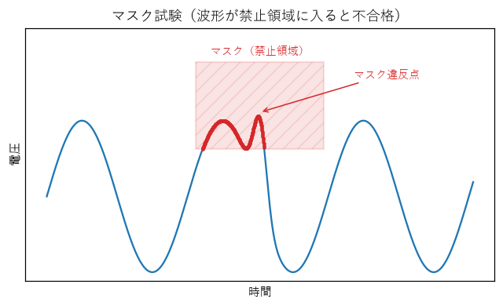
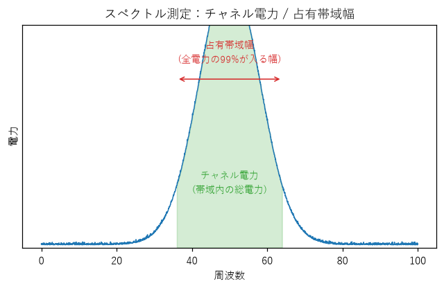
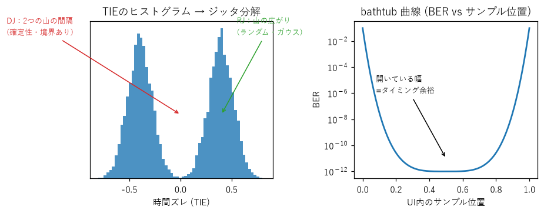
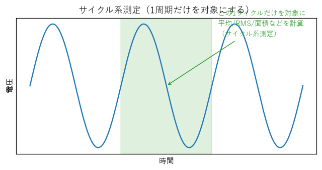
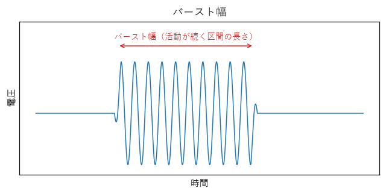

### 統計・テーブル
- **パラメータ統計テーブル**：選んだ測定を「平均/最大/最小/σ」でまとめて表に（多数の取得を集計）。【×】
- **パラメータ間演算 (Parameter Math)**：測定値どうしを四則演算（例：立上り÷周期）。【×】
- **ヒストグラムボックス測定 (HITS/MEDian/PEAKHits/SIGMA1-3/WAVEFORMS)**：図⑧ 電圧ヒストグラムの箱から、点数 / 中央 / 最頻ビンの点数 / ±1〜3σ内の割合 / 波形数。【×（Top/Baseと単一σのみ）】

### FFT / スペクトル
- **FFT窓 (hann/hamming/blackman/flattop/rect ＋ Gaussian/Kaiser/Blackman-Harris)**：切り出しの「窓関数」。漏れ⇔分解能/振幅確度のトレードオフ。【△ 追加窓は×】
- **スペクトル出力種別 (magnitude/dB / power density / magnitude squared / phase / real / imaginary / group delay)**：スペクトルの表示形式の違い。【△】
- **THD / SNR / SINAD / ENOB / SFDR**：図③。【○】　**THDa/THDu/THDr**：THDの電圧ベース変種。【×】
- **チャネル電力 / 占有帯域幅 / 高調波サーチ**：図⑩ 帯域内の総電力 / 全電力の99%が入る幅 / 高調波を自動マーク。【×】
- **スペクトルピーク / マーカー**：スペクトルの山を自動検出・印。【△】

### 数学チャンネル
- **A± / × / ÷、積分 / 微分 / |A| / A² / 移動平均 / RCローパス**：既存の波形演算。【○】
- **任意数式エディタ (128文字・名前付き変数 VAR1/VAR2)**：自由な式（例 `SINE(CH1)*(VAR1+CH2)`）で新波形。【×】
- **三角/逆三角/双曲、exp/log/sqrt/rescale**：各種関数演算。【×（square のみ）】
- **Autocorrelation / Crosscorrelation**：自己/相互相関（繰り返し性・2信号の遅延を見る）。【×】
- **周波数領域 math (magnitude/phase/real/imaginary/group delay)**：FFT結果を波形として扱う。【×】
- **論理・関係演算子**：and/or/比較などで波形を加工。【×】
- **Deskew / Envelope / Enhanced resolution**：2chの時間ズレ補正 / 包絡線 / 平滑で実効ビット向上。【×】
- **補間 (cubic/quadratic/sinx-x) / ユーザFIR / digital LPF・HPF**：点の補間種別・任意フィルタ。【×（線形補間のみ）】

### 信号品質・SI
- **アイダイアグラム**：図④ 表示。【○】　**構造化アイ測定 (eye height/width, Q factor, 消光比ER, DCD, jitter pp/RMS)**：図④ を数値化。【×】
- **マスク試験**：図⑨ 禁止領域に入ると不合格。**マスクマージン/ヒット率**＝余裕/違反数。【○（マージン/ヒット率は△）】
- **スペクトログラム**：時間×周波数の濃淡表示。【○】

### プロトコル解読
- **UART / I2C / SPI**：シリアル信号を文字/データに解読。【○】
- **CAN / LIN / CAN-FD / I2S / RS-232 / USB / Ethernet / MIL-1553 / ARINC429**：各種シリアル規格の解読。【×】

---

## 5a. 既存アルゴリズムの検証結果（手順5の検証部分）

**✅ 標準定義と一致を確認できたもの（一次出典の式で照合）**
- 振幅 = Vtop − Vbase（Keysight `:MEASure:VAMPlitude?`／Tek `Amplitude=High-Low`）→ 本ソフト「振幅(Top-Base)」と一致。
- オーバーシュート = ((Vmax−Vtop)/(Vtop−Vbase))×100、アンダー = ((Vbase−Vmin)/Amplitude)×100（Keysight/Tek 逐語）→ 本ソフトと一致。
- 立上り = time@upper − time@lower、立下り = 90%→10%、既定閾値10/50/90%（Keysight/Tek）→ 本ソフトの立上り(10-90%)/立下り(90-10%)と一致。**ただし実機は閾値可変（5〜95%、20-80%・@level）で、本ソフトは10-90%固定**＝部分的。
- +デューティ = (+幅/周期)×100（Tek 逐語）→ 一致。
- FFT窓 hann/hamming/blackman/flattop/rect は実機の窓集合と重複（用途：Hann=分解能、Flattop=振幅確度、Blackman-Harris=最小漏れ）。
- Top/Base のヒストグラム法は IEEE Std 181 の top/base 推定法と整合（密度分布の最頻レベル）。

**⚠️ 検証材料が未充足（要・追加一次出典）**
- **THD/SNR/SINAD/ENOB/SFDR の定義式**：確認した実機データシート（RTO6/Keysight/Tek）には**標準定義式が無い**（RTO6はTHDのみ言及、SINADは0件、ENOB/SNR/SFDRはスペック表のみ）。本ソフトの実装（THD-F=√(Σ高調波P/基本波P)、SNR=10log(基本波/雑音)、SINAD=10log(基本波/(雑音+歪))、ENOB=(SINAD−1.76)/6.02、SFDR=基本波/最大スプリアス）は**教科書的標準と整合的だが、一次規格(IEEE 1241/1057, ADC試験規格)での照合が未完**。
- ジッタTIE→RJ/DJ分離・dual-Dirac・bathtub：本ソフトはTIEのみ。LeCroy SDA III / Keysight FlexDCA の定義出典は取得済（次段で照合可能）。

---

## 5b. 不足SW機能の実装候補（実装は保留・優先度順の素案）

1. **パラメータ統計テーブル**（選択測定を avg/high/low/σ/min/max で集約表示）＋**パラメータ間演算** … 最も“高級機らしさ”が出る。既存測定の再利用で実装容易。
2. **サイクル系測定の拡充**（Cycle Mean/RMS/σ/Median、burst width、slew rate、duty cycle error）… 既存のサイクル検出を流用可能。
3. **構造化アイ測定**（eye height/width、Q factor、extinction ratio、DCD、jitter pp/RMS）… 既存アイダイアグラムに測定値を付加。
4. **任意数式math**（安全な式パーサ＋名前付き変数）… 固定演算からの大幅拡張。
5. **ヒストグラムボックス測定**（HITS/MEDian/PEAKHits/SIGMA1-3）。
6. **スペクトル測定の拡充**（channel power、occupied bandwidth、harmonic search、power density出力）。
7. **追加FFT窓**（Blackman-Harris、Kaiser、Gaussian）と**補間種別**（cubic/sinx-x）。
8. **ジッタ分解**（TIEからRJ/DJ、bathtub）… 出典の式照合後。

---

## 6. 限界・注意（正直な前提）

- **網羅の限界**：一次出典で深く検証したのは Keysight/Tektronix/R&S/Teledyne LeCroy/Siglent/PicoScope の代表機種。**Rigol/GW Instek/Yokogawa(DLM)/NI は未到達**。指示の「できる限り多数」に対し代表標本であり、追加調査でマトリクスを拡張可能。
- **検証で棄却したクレーム（本レポートに不採用）**：Tek 4B「3プロットタイプ(Time Trend/Histogram/Spectrum)」は1-2で否決、TBS2000「28測定リスト」は0-3で否決、PicoScope「立上り90/10 or 80/20」は1-2で否決（＝既定閾値は不確実）。
- **取得不可のURL**：Keysight 3000T データシート(5992-0140.pdf)はJSゲートで本文取得不可（4000X Programmer's Guideを代替一次出典に使用）。Siglent URLは404（公式ミラーで逐語確認）。
- **比率指標の式照合が未完**：THD/SNR/SINAD/ENOB/SFDR は IEEE Std 1241/1057 等を別途当たる必要（§5a）。
- **HW依存機能は対象外**：帯域/サンプルレート/トリガ種別/チャネル数/ロジック取得/AWG出力は原理上ソフトで再現不可のため差分から除外。

---

*検証ステータス：26出典→124クレーム→25検証→22確定(3-0)／3棄却。全クレームはベンダー公式一次資料に基づく。*
