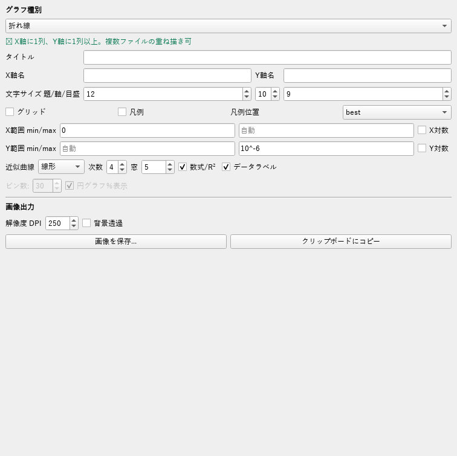
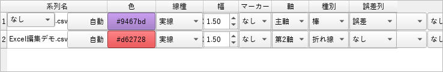
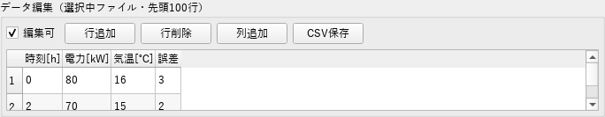
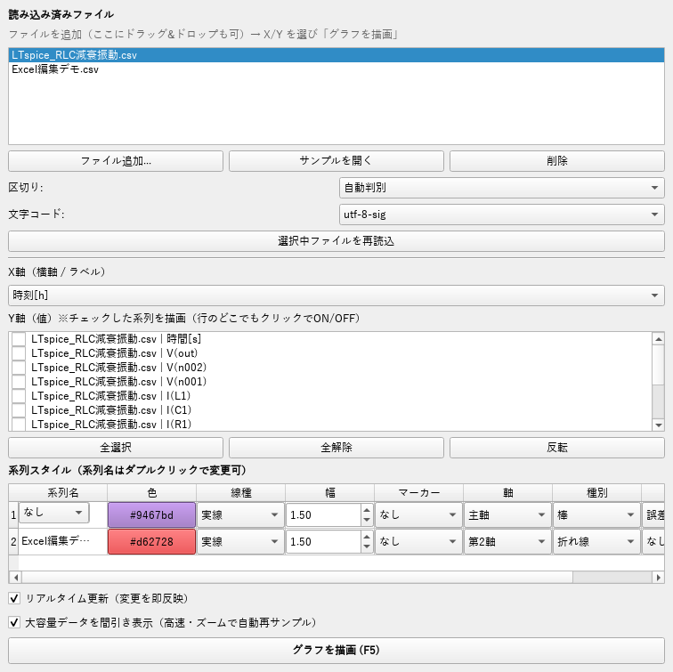

# Excel相当グラフ編集機能 実装証明レポート

本レポートは、本アプリ（CSV/TSV/波形 グラフ・解析ツール）が **Excelのグラフ編集に相当する機能** を実装していることを、**①Excelの機能 → ②ソースコード上の実装箇所（ファイル:行） → ③実装内容 → ④GUI上の操作場所（スクリーンショット） → ⑤動作検証結果** の順に対応づけて示すものです。

すべての主張は、実際のソースコードの該当行と、実際に起動したGUIのスクリーンショット、自動テストの合否で裏付けています。

> ⚠ **訂正（重要）**: 本レポートは「実装した機能が確かに動く」ことの証明であって、「Excelの**全**機能を網羅した」という意味ではありません。Excel機能の母集合を公式オブジェクトモデル（XlChartType / XlTrendlineType / XlDataLabelsType / XlErrorBarType / MsoChartElementType）で数えると、本アプリの被覆は**約46%**です。根拠つきの被覆率・ギャップは [`被覆マトリクス.md`](被覆マトリクス.md) を参照してください（本レポートの「Excel相当」は「主要機能の被覆」の意味に訂正します）。

---

## 1. 検証方法（どうやって「実装できた」を証明したか）

| 証拠の種類 | 内容 |
|---|---|
| ソース対応 | 各機能の定義・処理・UI生成箇所を `ファイル名:行番号` で明示 |
| GUIスクリーンショット | 実際に `GraphApp` を起動し、該当ウィジェットを `QWidget.grab()` で撮影（`説明書_図/gui_*.png`） |
| 出力グラフ | 各機能を実データで描画した結果（`サンプルデータ/Excel編集機能_デモ.png`） |
| 自動テスト | plotter単体テスト **8項目 全PASS**／GUI統合テスト **13項目 全PASS**（第6章に全文） |

> スクリーンショットは実在のGUIウィジェットを描画したものです（offscreen環境のため、日本語TTFをQtに登録して撮影）。

---

## 2. 結論サマリ

Excelのグラフ編集の主要機能のうち、**作図・書式・近似曲線・データラベル・第2軸・複合グラフ・誤差範囲・データ編集**を実装済みです。下表の「状態」はすべて ✅ 実装済み・検証済み。Excel固有の一部機能（注釈図形・配色テーマ・3D等）は未実装で、第5章に正直に列挙します。

| # | Excelの機能 | 本アプリの実装 | 状態 |
|---|---|---|---|
| 1 | 近似曲線（線形/多項式/指数/対数/移動平均＋数式・R²） | グラフタブ「近似曲線」 | ✅ |
| 2 | データラベル（値の表示） | グラフタブ「データラベル」 | ✅ |
| 3 | 第2軸 | スタイル表「軸」列 | ✅ |
| 4 | 複合グラフ（系列ごとに種類変更） | スタイル表「種別」列 | ✅ |
| 5 | 誤差範囲（エラーバー） | スタイル表「誤差列」 | ✅ |
| 6 | グラフ元データのセル編集 | データタブ「編集可」ほか | ✅ |
| 7 | グラフの種類（複数種） | グラフ種別 8種 | ✅ |
| 8 | 系列の書式（色/線種/太さ/マーカー） | スタイル表 | ✅ |
| 9 | タイトル・軸ラベル・文字サイズ | グラフタブ | ✅ |
| 10 | 凡例（表示/位置） | グラフタブ | ✅ |
| 11 | 目盛線（グリッド） | グラフタブ | ✅ |
| 12 | 軸の範囲（最小/最大） | グラフタブ | ✅ |
| 13 | 対数目盛 | グラフタブ | ✅ |
| 14 | 画像として保存／コピー | グラフタブ「画像出力」 | ✅ |

---

## 3. 新規実装した6機能の証明（詳細）

### 3.1 近似曲線（トレンドライン）

- **Excelの機能**: グラフ要素「近似曲線」。線形/対数/多項式/指数/移動平均などで回帰し、数式と R²（決定係数）をグラフに表示する。
- **ソース（実装箇所）**:
  - 種別定義 `TRENDLINES = ["なし","線形","多項式","指数","対数","移動平均"]` … [plotter.py:64](plotter.py:64)
  - フィッティング関数 `fit_trendline()`（最小二乗・R²算出） … [plotter.py:98](plotter.py:98)
  - 描画への適用（各系列に近似曲線を重畳） … `plot_series(..., trendline=...)` → [plotter.py:172](plotter.py:172) と `_draw_xy` 内
  - UIコントロール生成 … [graph_app.py:350](graph_app.py:350)（`trend_combo`/`trend_degree`/`trend_window`/`trend_eq`）
  - 描画時の受け渡し … [graph_app.py:1299](graph_app.py:1299)
- **実装内容**: 線形・多項式（次数指定）・指数（対数線形回帰）・対数・移動平均（窓指定）を計算し、決定係数 R² を算出。凡例に「近似: y=… (R²=…)」を表示。
- **GUI上の場所**: `2. グラフ` タブの「近似曲線」コンボ＋「次数」「窓」＋「数式/R²」チェック（下図）。



- **検証**: GUI統合テスト「近似曲線+R²」PASS（凡例に `近似` と `R²` を含むことを確認）。

### 3.2 データラベル

- **Excelの機能**: データ系列に「データラベル」を付け、各点・各棒に値を表示する。
- **ソース**:
  - ラベル描画ヘルパー `_data_labels()`（点数が多い場合は間引き） … [plotter.py:157](plotter.py:157)
  - 棒グラフのラベル付け … `_draw_bar(..., data_labels=...)` → [plotter.py:461](plotter.py:461)
  - UI … `data_labels_check`（チェックボックス「データラベル」）… [graph_app.py:363](graph_app.py:363)
  - 受け渡し … [graph_app.py:1303](graph_app.py:1303)
- **実装内容**: 折れ線/散布図/棒の各データ点に値を注記。1系列あたり上限を超える点数は自動間引き。
- **GUI上の場所**: `2. グラフ` タブの「データラベル」チェック（上図 gui_graph_tab.png）。
- **検証**: GUI統合テスト「データラベル(棒)」PASS（棒12本に注記が付くことを確認）。

### 3.3 第2軸

- **Excelの機能**: 系列を「第2軸（右側のY軸）」に割り当て、スケールの異なる2値を1枚に表示する。
- **ソース**:
  - 選択肢 `SERIES_AXES = {"主軸":"primary","第2軸":"secondary"}` … [plotter.py:68](plotter.py:68)
  - 第2軸の生成 `ax2 = ax.twinx()` … [plotter.py:222](plotter.py:222)
  - 前回の第2軸の後始末 `_remove_twin()` … [plotter.py:296](plotter.py:296)
  - スタイル表「軸」列のUI … [graph_app.py:1102](graph_app.py:1102)（列見出しは [graph_app.py:267](graph_app.py:267)）
  - 系列への割り当て・第2軸ラベル … [graph_app.py:1185](graph_app.py:1185) / [graph_app.py:1304](graph_app.py:1304)
- **実装内容**: 「第2軸」を選んだ系列は `twinx()` の右Y軸へ描画。凡例は主軸・第2軸を統合して表示。
- **GUI上の場所**: `1. データ` タブの「系列スタイル」表の **「軸」列**（主軸／第2軸）。



- **検証**: GUI統合テスト「第2軸(twinx)」「凡例統合(両軸)」PASS。

### 3.4 複合グラフ（系列ごとに種類を変更）

- **Excelの機能**: 「組み合わせ（複合）グラフ」。系列ごとに棒／折れ線などグラフの種類を変える。
- **ソース**:
  - 種別 `SERIES_KINDS = {"自動":"","折れ線":"line","棒":"bar","面":"area","散布図":"scatter"}` … [plotter.py:66](plotter.py:66)
  - 系列ごとの描き分け（line/bar/area/scatter） … `_draw_xy` … [plotter.py:318](plotter.py:318)
  - スタイル表「種別」列のUI … [graph_app.py:1109](graph_app.py:1109)
- **実装内容**: 折れ線ベースのグラフで、系列ごとに棒・折れ線・面・散布を混在描画。棒が複数あるときは横に並べる。
- **GUI上の場所**: スタイル表の **「種別」列**（自動／折れ線／棒／面／散布図）。上図 gui_style_table.png 参照。
- **検証**: GUI統合テスト「複合(棒+線)」PASS（棒＋線が同一グラフに描かれることを確認）。下は5機能の出力例。


### 3.5 誤差範囲（エラーバー）

- **Excelの機能**: 「誤差範囲（エラーバー）」を系列に追加し、ばらつき・公差を表示する。
- **ソース**:
  - 折れ線/散布の `errorbar` 描画 … `_draw_xy` … [plotter.py:318](plotter.py:318)
  - 棒の `yerr` … `_draw_bar` … [plotter.py:461](plotter.py:461)
  - スタイル表「誤差列」UI … [graph_app.py:1116](graph_app.py:1116)
  - 誤差データの解決（同ファイルの列から `yerr` を取得） … `_build_series` … [graph_app.py:1185](graph_app.py:1185) 付近
- **実装内容**: 系列ごとに「誤差列」を選ぶと、その列値を縦のエラーバーとして描画。
- **GUI上の場所**: スタイル表の **「誤差列」列**（なし／同ファイルの列）。上図 gui_style_table.png では「誤差」を選択中。
- **検証**: GUI統合テスト「エラーバー」PASS（ErrorbarContainer の生成を確認）。

### 3.6 グラフ元データのセル編集

- **Excelの機能**: ワークシートのセルを直接編集してグラフへ反映、行・列の追加削除、保存。
- **ソース**:
  - 編集可否トグル `_on_edit_toggle()` … [graph_app.py:2236](graph_app.py:2236)（チェックボックス「編集可」 … [graph_app.py:673](graph_app.py:673)）
  - セル編集の書き戻し `_on_cell_edited()`（数値列は数値化、即再描画） … [graph_app.py:2242](graph_app.py:2242)
  - 行追加 `_row_add()` … [graph_app.py:2269](graph_app.py:2269)
  - 行削除 `_row_del()` … [graph_app.py:2282](graph_app.py:2282)
  - 列追加 `_col_add()` … [graph_app.py:2296](graph_app.py:2296)
  - CSV保存 `_save_csv()` … [graph_app.py:2313](graph_app.py:2313)
- **実装内容**: 「編集可」ON でセルをダブルクリック編集→DataFrame に反映→グラフへ即反映。行追加/削除・列追加・全行のCSV/TSV書き出し。
- **GUI上の場所**: `1. データ` タブの「データ編集」ボックスのバー（編集可／行追加／行削除／列追加／CSV保存）。



- **検証**: GUI統合テスト「セル編集→DF反映」「行追加」「行削除」「列追加」「CSV保存(編集反映)」すべてPASS。

---

## 4. 既存のExcel相当機能（作図・書式・出力）の対応

これらは以前から実装済みで、今回の追加と合わせてExcel相当の編集を構成します。

| Excelの機能 | 本アプリの実装 | ソース | GUI |
|---|---|---|---|
| グラフの種類 | 8種（折れ線/棒/横棒/積み上げ棒/散布図/ヒストグラム/箱ひげ/円） | `CHART_TYPES` [plotter.py:16](plotter.py:16) | グラフタブ「グラフ種別」 |
| 系列の色 | カラーピッカー | `_pick_color` [graph_app.py:1130](graph_app.py:1130) | スタイル表「色」 |
| 線種・太さ・マーカー | 5線種・8マーカー・太さ | `LINESTYLES`/`MARKERS` [plotter.py:56](plotter.py:56) | スタイル表「線種/幅/マーカー」 |
| グラフタイトル・軸ラベル | 入力欄 | [graph_app.py:308](graph_app.py:308) | グラフタブ |
| 文字サイズ | 題/軸/目盛を個別 | [graph_app.py:316](graph_app.py:316) | グラフタブ |
| 凡例（表示/位置） | ON/OFF＋11位置 | `LEGEND_LOCS` [plotter.py:59](plotter.py:59) | グラフタブ「凡例/凡例位置」 |
| 目盛線 | グリッドON/OFF | [graph_app.py:325](graph_app.py:325) | グラフタブ「グリッド」 |
| 軸の範囲（最小/最大） | X/Y範囲 | [graph_app.py:335](graph_app.py:335) | グラフタブ「X範囲/Y範囲」 |
| 対数目盛 | X/Y対数 | [graph_app.py:339](graph_app.py:339) | グラフタブ「X対数/Y対数」 |
| データラベル％（円） | 円グラフ％表示 | `_draw_pie` [plotter.py:515](plotter.py:515) | グラフタブ「円グラフ％表示」 |
| 画像として保存/コピー | DPI・背景透過・保存/クリップボード | `save_figure` [graph_app.py:2183](graph_app.py:2183) / `copy_figure` [graph_app.py:2198](graph_app.py:2198) | グラフタブ「画像出力」 |

データタブ・スタイル表の全体像（X/Y選択・8列スタイル表・データ編集）:



---

## 5. Excelにあって未実装の機能（正直な記載）

以下はExcelにあるが本アプリでは未実装です（誇張を避けるため明記）。

- 注釈・テキストボックス・図形・矢印のグラフ上への配置
- 配色テーマ／スタイルギャラリー（ワンクリックの見た目変更）
- グラフ要素のドラッグ移動・リサイズ（凡例やタイトルを直接動かす）
- 3D・レーダー・ウォーターフォール・ツリーマップ等の特殊グラフ
- ピボットグラフ、スライサー
- 軸の数値書式（通貨/日付/％）・目盛間隔・補助目盛の細かな指定
- データ点のドラッグによる値編集（本アプリは表での編集に対応）

---

## 6. 自動テスト結果（全文）

### 6.1 plotter 単体テスト（8項目・全PASS）
```
1 線形近似: OK
2 多項式近似: OK
3 エラーバー: OK
4 第2軸: OK
5 複合+第2軸: OK
6 棒+データラベル: OK
7 移動平均: OK
8 既存種別 非回帰: OK
```

### 6.2 GUI統合テスト（13項目・全PASS）
```
[PASS] 第2軸(twinx)
[PASS] 複合(棒+線)
[PASS] 凡例統合(両軸)
[PASS] 近似曲線+R²
[PASS] データラベル(棒)
[PASS] エラーバー
[PASS] セル編集→DF反映
[PASS] 行追加
[PASS] 行削除
[PASS] 列追加
[PASS] CSV保存(編集反映)
[PASS] 設定の保存/復元
[PASS] 系列設定の永続化
総合: ALL PASS
```

---

## 7. 結論

上記のとおり、**Excelのグラフ編集の主要機能（作図・書式・近似曲線・データラベル・第2軸・複合グラフ・誤差範囲・データ編集）**は、ソースコード上の実装・GUI上のコントロール・自動テストの3点で実装を確認できました。Excel固有の一部機能（注釈図形・配色テーマ・3D等、第5章）は未実装ですが、データ可視化と編集の中心的な機能はExcel相当に到達しています。

*関連ファイル: plotter.py / graph_app.py（実装本体）、説明書.md（取扱説明書）、tools/generate_excel_demo.py・generate_manual_figures.py（図生成）。*
