# CSV / TSV / 波形 グラフ・解析ツール 取扱説明書

CSV・TSV・波形データの読み込み、グラフ作図（Excel相当の編集）、オシロスコープ表示、ピーク/各種測定・FFT、マスク/アイ/ジッタ・プロトコル解読までを行えるデスクトップアプリの操作説明書です。

## 目次

- 1. 概要・起動・画面構成
- 2. データタブ（読み込み・編集）
- 3. グラフ書式パネル（作図とExcel相当の編集）
- 4. オシロ/解析タブ（波形測定）
- 5. 高度解析タブ
- 6. データサイエンスタブ（回帰・統計・相関）
- 7. 設定の保存・サンプルデータ・困ったとき
- 図例ギャラリー（入力データ例と出力グラフ例）
- 実例・チュートリアル
- 付録：困ったとき / よくある質問

---


## 1. 概要・起動・画面構成

### 1.1 このアプリの目的

本アプリは、CSV / TSV / 波形データを読み込み、グラフ描画・データ編集・オシロスコープ表示・各種解析（ピーク / 測定 / FFT / 高度解析）まで行えるデスクトップアプリです。ウィンドウのタイトルは `CSV / TSV / 波形 グラフ・解析ツール` です。

- 複数ファイルを同時に読み込み、重ね描きできます。
- 日本語の列名・タイトル・軸ラベルに対応しています。
- グラフは8種類から選べます。

| 項目 | 内容 |
| --- | --- |
| 対応データ形式 | CSV(`.csv`) / TSV(`.tsv`) / テキスト(`.txt`) |
| 文字コード・区切り | 自動判定（手動指定も可能） |
| ウィンドウ初期サイズ | 1280 × 800 |

> 補足: 文字コードや区切り文字は読み込み時に自動で判定されるため、ふつうはそのまま開くだけで表示できます。

### 1.2 セットアップ（初回のみ）

初めて使うときは、依存ソフトをインストールするセットアップを1回だけ行います。

**操作手順**

1. プロジェクトのフォルダにある `セットアップ.bat` をダブルクリックします。
2. 専用の仮想環境（`C:\.venv`）が自動で作成され、必要なライブラリがインストールされます。
3. 完了すると、`起動.bat` で起動するよう案内が表示されます。

> 補足: 推奨環境は Python 3.12（3.9以上）です。`pandas` / `matplotlib` / `PySide6` / `numpy` / `scipy` などがインストールされます。

### 1.3 起動方法

セットアップが終わったら、次のいずれかの方法で起動します。

- **かんたん起動**: プロジェクトのフォルダにある `起動.bat` をダブルクリックします。コンソール窓は表示されず、グラフ画面だけが開きます。
- **手動起動**: 仮想環境を有効化したうえで `python graph_app.py` を実行します。

### 1.4 画面構成

画面は左・中央・右の3つの領域に分かれています。左で操作タブを選び、中央にグラフとデータ、右にグラフの書式設定が表示されます。境界線をドラッグすると、各エリアの幅・高さを変えられます。

```
┌─────────┬───────────────────┬───────────────┐
│ 左：操作タブ    │ 中央上：グラフ表示エリア        │ 右：グラフ書式パネル    │
│ （4つのタブ）   ├───────────────────┤ （書式＋系列スタイル）  │
│                 │ 中央下：データ編集（先頭100行） │                       │
└─────────┴───────────────────┴───────────────┘
```

- **左パネル**: 4つの操作タブが縦に並びます（次表）。
- **中央上**: グラフ表示エリア。上部に系列ON/OFFバー（折れ線・散布図のとき表示）と、拡大・パンなどができる matplotlib のナビゲーションツールバーがあります。
- **中央下**: 選択中ファイルの先頭100行を編集できるデータ編集エリア。
- **右パネル**: グラフ書式パネル。グラフ種別・タイトル/軸名・軸範囲・近似曲線・画像出力などの書式コントロール（上段）と、系列ごとの色・線種などを編集する `系列スタイル` 表（下段）が常時表示されます。
- **最下部**: ステータスバー。操作の案内や読み込み結果（行数×列数・文字コードなど）を表示し、右端には採用された日本語フォント名（例 `日本語: Yu Gothic`）を常に表示します。

左パネルのタブは、左から順に進めるのが基本の流れです。グラフの見た目（種別・タイトル・スタイルなど）は、どのタブを開いていても右側のグラフ書式パネルでいつでも調整できます。

| 左タブ | 主な役割 |
| --- | --- |
| `1. データ` | ファイル読み込み、X/Y軸の選択 |
| `2. オシロ/解析` | オシロスコープ表示、ピーク/測定、FFT |
| `3. 高度解析` | 数学チャンネル、FFT詳細、マスク/アイ/ジッタ、プロトコル解読など |
| `4. データサイエンス` | 線形回帰、記述統計、正規性検定、相関行列 |

| 右パネル | 主な役割 |
| --- | --- |
| `グラフ書式パネル` | グラフ種別、タイトル/軸名、軸範囲・目盛り間隔、近似曲線、系列スタイル、画像出力 |

### 1.5 メニュー一覧

画面上部のメニューバーには4つのメニューがあります。主な項目とショートカットは次のとおりです。

| メニュー | 項目（ショートカット） |
| --- | --- |
| `ファイル(F)` | `ファイル追加...`(Ctrl+O) / `最近使ったファイル`(最大12件) / `グラフ画像を保存...`(Ctrl+S) / `ファイルごとに一括画像出力...`(Ctrl+B) / `クリップボードにコピー`(Ctrl+Shift+C) / `設定を保存...`(Ctrl+Shift+S) / `設定を読み込み...` / `終了`(Ctrl+Q) |
| `表示(V)` | `グラフを描画`(F5) / `全データに合わせる（オートスケール）` |
| `解析(A)` | `解析実行（ピーク・測定）`(Ctrl+R) / `FFTスペクトル表示` |
| `ヘルプ(H)` | `使い方`(F1) / `バージョン情報` |

### 1.6 データの読み込み方法

ファイルを開く方法は2通りあります。

1. **メニューから追加**: `ファイル(F)` → `ファイル追加...`（Ctrl+O）を選びます。
2. **ドラッグ&ドロップ**: エクスプローラーからファイルをウィンドウへドラッグします。`.csv` / `.tsv` / `.txt` を受け付け、複数同時も可能です。すでに描画済みなら自動で再描画されます。

> 同梱の `サンプルデータ` フォルダ（後述）には、すぐ試せる CSV/TSV が用途別に入っています。上記いずれかの方法で読み込んで動作を確認できます。

### 1.7 便利な機能

- **リアルタイム更新**: `1. データ` タブ下部のチェックボックス `リアルタイム更新（変更を即反映）` をオンにすると、グラフ種別・タイトル/軸名・軸範囲・凡例などの設定変更が自動でグラフに反映されます（既定オン、約180msでまとめて再描画）。大容量データのときはオフを推奨します。
- **日本語フォント自動設定**: 起動時にOS内の日本語フォントを自動で探して適用し、タイトル・軸ラベル・凡例の文字化け（□□□）やマイナス記号の化けを防ぎます。採用フォント名はステータスバー右端に表示されます。

### 💡 例: 付属の波形データを開いて画面の見え方を確認する

初めて起動したとき、付属の波形データですぐに動作を試せます。

1. `起動.bat` をダブルクリックしてアプリを起動します。
2. メニューバーの `ファイル(F)` → `ファイル追加...`（Ctrl+O）を選び、`サンプルデータ\波形_減衰振動.csv` を開きます（エクスプローラーからウィンドウへドラッグ&ドロップでも読み込めます）。
3. `1. データ` タブで `X軸（横軸 / ラベル）` に時間の列、`Y軸（値）` で波形の列にチェックを入れ、`グラフを描画 (F5)` を押します。中央上のグラフ表示エリアに `折れ線` グラフが表示されます。
4. 中央下のデータ編集エリアに、読み込んだファイルの先頭100行が表示されることを確認します。
5. 最下部のステータスバー右端で、採用された日本語フォント名（例 `日本語: Yu Gothic`）が表示されていることを確認します。

これで、左パネルのタブ・中央のグラフ／データ編集・右のグラフ書式パネルという基本の画面構成を一通り確認できます。

---

## 2. データタブ（読み込み・編集）

`1. データ` タブは、グラフのもとになるファイルを読み込み、軸を選び、必要なら表を編集するための画面です。基本の流れは画面上部のヒントに示されています。

> ファイルを追加（ここにドラッグ&ドロップも可）→ X/Y を選び「グラフを描画」

このタブだけで「読み込み」から「描画」まで完結できます。

### 2-1. ファイルを読み込む

画面最上部に `読み込み済みファイル` の一覧があり、その下に操作ボタンが並びます。

| ボタン / 操作 | できること | 補足 |
| --- | --- | --- |
| `ファイル追加...` | ファイル選択ダイアログを開き、複数ファイルをまとめて読み込む | 対応形式: `*.csv` `*.tsv` `*.txt`。メニュー `ファイル(&F)→ファイル追加...`（`Ctrl+O`）でも同じ |
| `削除` | 一覧で選択中のファイル（Ctrl/Shift＋クリックで複数選択可）を一覧とデータから取り除く | 何も選んでいないときは何も起きません |
| `全削除` | 読み込み済みファイルをすべて一覧から取り除く | 一覧を空にして最初からやり直したいときに |
| ドラッグ&ドロップ | ウィンドウへファイルを直接落として一括読み込み | 受け付ける拡張子は `.csv` `.tsv` `.txt` のみ。複数同時可 |

読み込んだファイルは一覧にファイル名で並びます。行を選ぶと、中央下の `データ編集` プレビューにそのファイルの先頭100行が表示され、X/Y軸の候補も選んだファイルに合わせて切り替わります。同じ名前で別の場所にあるファイルを読み込むと、`名前 (2)` のように連番が付きます。

メニュー `ファイル(&F)→最近使ったファイル` には過去に開いたファイルが新しい順に最大12件並び、選ぶと再読み込みできます（存在しないパスを選ぶと案内が出て履歴から外れます）。

### 2-2. 文字化け・区切りがおかしいとき（再読込）

一覧の下のグリッドで、読み込み方法を手動指定できます。いずれも変更したあとに `選択中ファイルを再読込` を押すと反映されます。

| 項目 | 既定 | 選べる値 |
| --- | --- | --- |
| `区切り:` | `自動判別` | `カンマ ( , )` / `タブ ( \t )` / `セミコロン ( ; )` / `パイプ ( | )` |
| `文字コード:` | `自動判別` | `utf-8-sig` / `utf-8` / `cp932` / `shift_jis` / `euc-jp` / `utf-16` |

- 区切りの `自動判別` は、拡張子（`.tsv` はタブ）を優先し、それでも分からなければ先頭行の記号の出現回数などから推定します。
- 文字コードの `自動判別` は、BOMやUTF-8判定、日本語らしさのスコアなどを使って自動で選びます。文字が化けて見えるときだけ、ここで手動指定して読み直してください。
- `選択中ファイルを再読込` はファイル未選択だと「ファイルを選択してください。」と案内が出ます。

### 2-3. X軸・Y軸（描く列）を選ぶ

水平線の下で、グラフに使う列を選びます。

- `X軸（横軸 / ラベル）`: 横軸に使う列をコンボボックスから選びます。候補は読み込んだ全ファイルの列名をまとめたものです。波形データなら時間の列を選びます。
- `Y軸（値）`: 下のチェックリストで、描きたい系列（`ファイル｜列` の組）にチェックを入れます。チェックボックスだけでなく、**行のどこをクリックしても** ON/OFF が切り替わります。系列名を**ダブルクリック**すると凡例に表示する名前を変更できます。
- チェックリストの下の `全選択` / `全解除` / `反転` で、全系列のチェック状態をまとめて切り替えられます。

### 2-4. 表を編集する（データ編集）

中央下の `データ編集（選択中ファイル・先頭100行）` には、一覧で選んだファイルの先頭100行が表で表示されます。既定では読み取り専用です。上部のバーから次の操作ができます。

| 操作 | 内容 |
| --- | --- |
| `編集可` | チェックを入れるとセルを編集できる。値はその場でデータに反映され、グラフにも反映される。数値の列に入れた値は数値化され（変換できなければ空欄=NaN）、文字の列は文字のまま保存 |
| `行追加` | 選択中ファイルの末尾に、全列が空（NaN）の行を1行足す |
| `行削除` | プレビューで選んだ行（複数可）を削除し、再描画する。行を選んでいないと「削除する行を選択してください。」と表示 |
| `列追加` | 列名を入力すると、その名前の数値列を `0.0` で初期化して追加する。同名があると警告 |
| `CSV保存` | 編集後の**全行**を書き出す。`.tsv` ならタブ区切り、それ以外はカンマ区切り。文字コードは `utf-8-sig` |

> 注: プレビューに見えているのは先頭100行ですが、編集・行追加・行削除・保存は**全行**が対象です。

### 2-5. 描画と表示オプション

タブ下部に、描画の挙動を決めるオプションと描画ボタンがあります。

- `リアルタイム更新（変更を即反映）`（既定オン）: 設定やデータの変更を自動でグラフへ反映します。大容量データではオフが推奨です。
- `大容量データを間引き表示（高速・ズームで自動再サンプル）`（既定オン）: 点数が多い折れ線・散布図を、見た目を保ったまま間引いて高速に描きます。ズームすると自動で再サンプルされます。
- `グラフを描画 (F5)`: 現在のX軸・Yのチェック・設定でグラフを描きます。メニュー `表示(&V)→グラフを描画`（`F5`）でも同じです。

### 2-6. 操作手順（基本の流れ）

1. `1. データ` タブを開く。
2. `ファイル追加...` を押し、ダイアログでファイルを選んで読み込む（またはウィンドウへドラッグ&ドロップ）。
3. もし文字化けや区切りがおかしければ、`区切り:` `文字コード:` を直してから `選択中ファイルを再読込` を押す。
4. `X軸（横軸 / ラベル）` で横軸の列を選ぶ。
5. `Y軸（値）` のチェックリストで、描きたい系列にチェックを入れる（`全選択` などで一括も可）。
6. `グラフを描画 (F5)` を押す。

### 💡 例: サンプルの減衰振動波形を開いて時間軸で描く

1. `1. データ` タブを開く。
2. `ファイル追加...`（または `Ctrl+O`）で `サンプルデータ\波形_減衰振動.csv` を読み込む（ウィンドウへのドラッグ&ドロップでも可）。`X軸（横軸 / ラベル）` で時間の列、`Y軸（値）` で波形の列にチェックを入れ、`グラフを描画 (F5)` を押すと `折れ線` グラフが表示されます。
3. もっと細かく見たいので、中央下 `データ編集` のバーで `編集可` にチェックを入れる。
4. 不要な行を表で選び、`行削除` を押して取り除く（変更はグラフにも即反映）。
5. 編集後のデータを残すため、`CSV保存` を押し、ファイル名に `.csv` を付けて保存する（カンマ区切り・`utf-8-sig` で書き出されます）。

---

## 3. グラフ書式パネル（作図とExcel相当の編集）

読み込んだデータを 8 種類のグラフに描き分け、系列ごとに色・線種・マーカーなどを Excel のように細かく編集できる、画面右側のパネルです（現行版ではタブではなく、どの左タブを開いていても常時表示されます）。上段に書式コントロール、下段に `系列スタイル` 表が並びます。グラフ種別を選び、データタブで描画したい系列にチェックを入れ、`グラフを描画 (F5)` を押すのが基本の流れです。

### 3.1 まずは描画の基本フロー

1. グラフ書式パネル最上部の `グラフ種別` で作りたいグラフを選ぶ。直下の緑色のヒント（➤）に「必要な列」が表示されます。
2. `1. データ` タブの `X軸（横軸 / ラベル）` で横軸に使う列を選ぶ。
3. 同じデータタブの `Y軸（値）` チェックリストで、描画したい系列にチェックを入れる（行のどこをクリックしてもON/OFF）。
4. 必要に応じてグラフ書式パネルでタイトルや軸名、スタイルを編集する（後述）。
5. `グラフを描画 (F5)` ボタンを押す（キーボードの `F5` でも実行）。描画後はステータスに系列数や警告が表示されます。

`リアルタイム更新（変更を即反映）` がONのときは、ボタンを押さなくても設定変更が約180msで自動反映されます（既定ON、大容量データではオフ推奨）。

### 3.2 グラフ種別

`グラフ種別` コンボから次の 8 種を選べます（並び順は固定、既定は先頭の `折れ線`）。

| 種別 | 必要な列 | 複数ファイルの重ね描き |
|------|----------|------------|
| `折れ線` | X軸1列＋Y軸1列以上 | 可 |
| `棒` / `横棒` | X軸にカテゴリ列＋Y軸1列以上 | 不可（単一ファイル） |
| `積み上げ棒` | X軸にカテゴリ列＋Y軸2列以上 | 不可（単一ファイル） |
| `散布図` | X軸1列＋Y軸1列以上 | 可 |
| `ヒストグラム` | Y軸に値の列1列以上（X軸不要） | 可 |
| `箱ひげ` | Y軸に値の列1列以上（X軸不要） | 可 |
| `円` | X軸にラベル列＋Y軸に値の列1つ | 不可（単一ファイル） |

`ヒストグラム` と `箱ひげ` ではX軸の指定は無効化されます。

### 3.3 データの選択

X軸・Y軸の選択は `1. データ` タブで行います（「2-3. X軸・Y軸（描く列）を選ぶ」と同じ操作です）。ここでは作図の観点で要点をまとめます。

- **`X軸（横軸 / ラベル）`**: 横軸に使う列をコンボから選びます。波形なら時間列を選びます。
- **`Y軸（値）` チェックリスト**: 描画したい系列にチェックを入れます。複数ファイルを読み込んでいるときは「ファイル名 | 列名」で表示されます。行をダブルクリックすると系列名（凡例ラベル）を変更できます。下の `全選択` / `全解除` / `反転` ボタンでまとめて切り替えられます。

### 3.4 系列スタイル表（Excel相当の編集）

チェックした系列ごとに 1 行が並ぶ `系列スタイル` 表で、各セルを操作するとスタイルを編集できます（リアルタイム更新ONなら即反映）。列は左から次の 8 つです。

| 列 | 内容 | 選択肢・既定 |
|----|------|--------------|
| `系列名` | ダブルクリックで凡例ラベルを上書き | 任意テキスト（既定は元の表示名） |
| `色` | ボタンを押すとカラーピッカーが開く。選んだ色を背景と系列色に反映 | 任意のHEX色（既定は `自動`） |
| `線種` | 折れ線系の線スタイル | 実線(-)／破線(--)／一点鎖線(-.)／点線(:)／なし(None)。既定 `実線` |
| `幅` | 線幅（0.5刻み） | 0.2〜10、既定 1.5 |
| `マーカー` | 各データ点の記号 | なし／丸(o)／四角(s)／三角(^)／菱形(D)／×(x)／＋(+)／点(.)。既定 `なし` |
| `軸` | 折れ線/散布図で主軸か第2軸に割り当て | 主軸／第2軸。既定 `主軸` |
| `種別` | 折れ線/散布図ベースで系列ごとに形式を混在（複合グラフ） | 自動／折れ線／棒／面／散布図。既定 `自動` |
| `誤差列` | 同ファイル内の別列をY方向の誤差量にしてエラーバー表示 | なし＋同ファイルの全列。既定 `なし` |

- **第2軸**: `軸` 列で 1 つでも `第2軸` にすると右側にY軸が生成され、その系列名が第2軸ラベルになります（複数なら「 / 」で連結）。
- **複合グラフ**: `種別` で系列ごとに形式を混在できます。`棒` が複数あると横に並びます。`自動` はグラフ種別に従います。
- **エラーバー**: `誤差列` を選ぶと誤差バー（キャップ幅3）が付きます。誤差バー付きの系列では間引き表示は無効になります。

### 3.5 タイトル・軸名・文字サイズ

- `タイトル`: グラフ上部の題名（既定は空）。
- `X軸名` / `Y軸名`: 軸ラベル。`X軸名` が空のときはX軸に選んだ列名が使われます。円グラフでは軸名は使われません。
- `文字サイズ 題/軸/目盛`: 3 つのスピンボックスでそれぞれ指定（各 6〜40、既定 題=12／軸=10／目盛=9）。

### 3.6 表示オプション・軸範囲

- `グリッド`（既定ON）／`凡例`（既定ON）のチェックで表示を切り替え。
- `凡例位置`: best ほか 11 種から選択（既定 `best`）。
- `X範囲 min/max` / `Y範囲 min/max`: 最小・最大を入力（空欄＝自動。最小≥最大は無視）。
- `目盛り間隔 X/Y`: 軸の目盛り（1メモリ）の間隔を入力します（空欄＝自動）。例: X に `0.5`、Y に `10`。折れ線/散布図の数値軸でのみ有効で、対数軸やカテゴリ軸（棒/横棒/積み上げ棒/円など）では無効です。内部的には matplotlib の `MultipleLocator` で等間隔の目盛りを設定します。
- `X対数` / `Y対数`: 対数軸にする（折れ線/散布図向け。0以下は表示されず警告。既定OFF）。

### 3.7 近似曲線・データラベル

- `近似曲線`: 折れ線/散布図の各系列に近似曲線を系列色の破線で重ねます（数値X限定、棒は対象外）。種別は なし／線形(y=ax+b)／多項式／指数(y=a·e^(bx))／対数(y=a·ln(x)+b)／移動平均（既定 `なし`）。
- `次数`: `多項式` のときの次数（1〜6、既定2）。
- `窓`: `移動平均` のときの窓幅（2〜9999、既定5）。
- `数式/R²`: ONで凡例に近似式と決定係数R²（小数4桁）を表示（既定ON）。移動平均はR²なしで窓数を表示。
- `データラベル`: 各データ点/棒に値（書式 %.3g）を表示（既定OFF）。折れ線/散布図は点数が多いと最大40点に間引いて注記。積み上げ棒では非表示。

### 3.8 ヒストグラム・円グラフ専用

- `ビン数:`: ヒストグラムの階級数（1〜500、既定30。ヒストグラム選択時のみ有効）。
- `円グラフ％表示`: 円グラフの各扇形に百分率を表示（既定ON、円グラフ選択時のみ有効）。円は90度開始・時計回りで、正の値のみ描画されます。

### 3.9 描画後の系列ON/OFFバー

折れ線/散布図を描画すると、グラフ表示領域の上部に系列ごとのチェックバーが現れます。チェックを切り替えると表示/非表示を即時に切り替えられます（チェック文字は系列色で太字、既定すべてON）。

### 3.10 画像出力

`画像出力` 欄で書き出しの設定をします。

- `解像度 DPI`: 保存・コピー両方に適用（50〜1200、50刻み、既定150）。
- `背景透過`: ONで背景を透明にして保存/コピー（既定OFF）。
- `画像を保存...`: ファイルダイアログで保存。余白を詰め（bbox_inches=tight）、設定したDPI・背景透過を適用。形式は PNG／JPEG／PDF／SVG／EPS（既定ファイル名 graph.png）。
- `クリップボードにコピー`: 現在のグラフをPNG画像としてクリップボードへコピー（設定DPI・背景透過を適用）。

### 3.11 グラフのマウス操作（ホイールで拡大縮小）

描画後のグラフは、マウスホイールでも直接拡大・縮小できます（オシロスコープ表示でなくても使えます）。

| 操作 | 効果 |
| --- | --- |
| ホイール上 | マウスカーソルの位置を中心に拡大（表示範囲を ×0.8 に狭める） |
| ホイール下 | マウスカーソルの位置を中心に縮小（表示範囲を ×1.25 に広げる） |
| Shift+ホイール | X方向のみ拡大縮小（縦は固定。波形を横に伸縮したいときに便利） |

- ズームはマウスカーソルのある点を中心に行われるので、見たい部分にカーソルを置いてから回すと狙った位置を拡大できます。対数軸でも中心が保たれます。
- カーソル測定中、matplotlib ツールバーのパン/ズームを選択中、まだ描画していないとき、円グラフのときは無効です。
- オシロスコープ表示中はホイールの動作が変わり、`time/div`（Shift+ホイールで `V/div`）の拡大縮小になります（「4. オシロ/解析タブ」参照）。範囲を矩形で指定して拡大したいときは、グラフ上部の matplotlib ツールバーの虫眼鏡（ズーム）も使えます。

---

### 💡 例: 月別売上を折れ線グラフにして画像で保存する

サンプルデータの `月別売上.csv` を使い、月ごとの売上を折れ線で描いて画像に書き出します。

1. `月別売上.csv` を読み込んだ状態で、グラフ書式パネルの `グラフ種別` から `折れ線` を選ぶ（既定で選択済み）。
2. `X軸（横軸 / ラベル）` で月の列（例: `月`）を選ぶ。
3. `Y軸（値）` チェックリストで売上の列にチェックを入れる。
4. `系列スタイル` 表の `色` ボタンを押し、カラーピッカーで好みの色（例: 青系）を選ぶ。`マーカー` 列で `丸` を選んで各データ点に記号を付ける。
5. `タイトル` に「月別売上」、`Y軸名` に「売上」と入力する。
6. `グラフを描画 (F5)` を押す（または `F5` キー）。
7. `画像出力` 欄で `解像度 DPI` を 300 にし、`画像を保存...` を押して保存形式に PNG を選んで保存する。

---

## 4. オシロ/解析タブ（波形測定）

このタブでは、グラフを「オシロスコープ風」に表示しながら、選んだ波形（Y系列）に対してピーク検出や各種測定（最大値・周波数・立上り時間など）を行えます。

> 補足: 画面上のタブ名は「2. オシロ/解析」と表示されます（本書では機能の位置づけ上「4.」として説明します）。

### 4-1. このタブでできること（概要）

| 区分 | できること |
| --- | --- |
| 表示 | グラフを黒背景・緑グリッドのオシロスコープ風にする |
| 表示調整 | `time/div`・`V/div`・表示中心・目盛り分割数（div数）を設定する／マウスで直接操作する |
| 測定 | ピーク・谷の検出、最大値や周波数など多数の測定値の算出 |
| 周波数解析 | `FFTスペクトル表示` で周波数成分を表示 |
| カーソル | 2本の縦カーソルで Δt・ΔV・1/Δt を測る |
| 統計・比較 | サイクル統計、周波数トレンド、2系列の位相差/遅延 |

> 注意: オシロスコープ表示が使えるのは、チャート種別が「折れ線」または「散布図」のときだけです。

### 4-2. オシロスコープ表示の設定

最上部の `オシロスコープ表示（折れ線/散布図）` チェックボックス（既定はOFF）をONにすると、オシロ風表示と各種設定・マウス操作が有効になります。設定はその下のグリッドで行います。

| 設定 | UIラベル | 内容 | 既定値・範囲 |
| --- | --- | --- | --- |
| 水平軸スケール | `time/div [s]` | 横1目盛りあたりの時間。プリセット選択または手入力（編集可能） | 既定 `1ms`（`1ns`〜`1s` の1-2-5プリセット） |
| 垂直軸スケール | `V/div` | 縦1目盛りあたりの値。プリセット選択または手入力 | 既定 `500m`（`1m`〜`100` の1-2-5プリセット） |
| 水平中心 | `X位置(中心)` | 横方向の表示中心X座標 | 既定 `0` |
| 垂直中心 | `Y位置(中心)` | 縦方向の表示中心Y座標 | 既定 `0` |
| 横の分割数 | `X div数` | 画面横方向の升目の数 | 既定 `10`（2〜20） |
| 縦の分割数 | `Y div数` | 画面縦方向の升目の数 | 既定 `8`（2〜20） |

- `time/div`・`V/div` は `500us`・`1e-3` のような工学表記/指数表記の手入力にも対応します（単位 p/n/µ/u/m/k/M/G が使えます）。`time/div` または `V/div` が正の値でないとオシロ表示は自動的に無効になります。
- 表示範囲は次のように決まります。
  - 横: `X位置(中心)` ± （`X div数` ÷ 2 × `time/div`）
  - 縦: `Y位置(中心)` ± （`Y div数` ÷ 2 × `V/div`）
- `自動スケール（解析対象に合わせる）` ボタンを押すと、選択中の全Y系列が画面に収まるよう `time/div`・`V/div`・X中心・Y中心を自動設定します。

### 4-3. マウスでの表示操作

オシロ表示がONで、チャート種別が折れ線/散布図、カーソル測定がOFF、matplotlibツールバーが非選択のときだけ、グラフを直接操作できます。

| 操作 | 効果 |
| --- | --- |
| 左ドラッグ | 表示位置の移動（パン）。離すと `X位置`・`Y位置` 欄が更新 |
| 右ドラッグ（または 左+Shift） | スケール変更。横ドラッグで `time/div`、縦ドラッグで `V/div`。離すと欄が更新 |
| ホイール | `time/div` を拡大縮小（上=×0.8でズームイン／下=×1.25でズームアウト） |
| Shift+ホイール | `V/div` を拡大縮小（上=×0.8／下=×1.25） |

ドラッグ中はグラフ左下に現在値が緑文字で表示されます。なお、オシロ表示をOFFにしているときのホイール操作は、カーソル位置を中心にした通常の拡大縮小になります（「3.11 グラフのマウス操作（ホイールで拡大縮小）」を参照）。

### 4-4. 解析の対象と条件

区切り線の下で、解析の対象と条件を設定します。

| UIラベル | 内容 | 既定値・範囲 |
| --- | --- | --- |
| `解析対象:` | 測定・ピーク検出・FFT・トレンドの対象とするY系列を選ぶ。X軸はデータタブのX列（非数値Xは行インデックスを時間軸とみなす） | 選択中の各系列名 |
| `ピーク数 N:` | 検出・表示するピーク（谷・スペクトルピーク）の上位個数。第1=最大 | 既定 `5`（1〜50） |
| `平滑化(点):` | 偽ピークを抑える平滑化窓の点数。0=なし、3以上で平滑化後に検出（奇数推奨） | 既定 `0`（0〜501、2刻み） |
| `ピークをグラフに表示` | ONで検出ピークを赤マーカー「第N」として重ね描き | 既定 OFF |
| `表示範囲のみ測定（ズーム/オシロ窓に追従）` | ONで画面に見えているX範囲だけを対象に解析（範囲内に3点以上ある場合） | 既定 OFF |

### 4-5. 実行ボタンと結果

- `解析実行`: 解析対象のピーク・谷・各種測定値を計算し、ピーク表と測定値表を更新します。
- `FFTスペクトル表示`: FFTスペクトルを折れ線で描画し、スペクトルピーク（第N/周波数）をマーカー表示。ピーク表は周波数で更新されます。窓関数・dB表示は「3. 高度解析」タブの設定（既定 hann窓・振幅表示）を使用します。
- `カーソル測定`（トグル）: ONにしてグラフを2回クリックすると赤い縦線カーソルを2本設置し、波形に追従するマーカー間で Δt・ΔV・1/Δt[Hz] を画面上部に表示します。カーソル線はドラッグ（近接8px以内で掴む）で微調整でき、3本目のクリックでリセットします。

結果は2つの表に出ます。

- ピーク表（`ピーク（第1=最大）`）: 列は `順位` / `時間・周波数` / `値`。`解析実行` 時は時間[ms]、`FFTスペクトル表示` 時は周波数[Hz]に切り替わります。
- 測定値表（`測定値`）: `項目` / `値（単位付き）`。算出不能な項目はハイフン表示。主な項目は次の順で並びます。

> 最大値 Vmax[V]、最小値 Vmin[V]、P-P値 Vpp[V]、平均 Vmean[V]、実効値 Vrms[V]、標準偏差 σ[V]、周期[s]、周波数(ゼロ交差)[Hz]、周波数(FFT)[Hz]、Top[V]、Base[V]、振幅 Vamp(Top-Base)[V]、オーバーシュート[%]、アンダーシュート[%]、立上り時間 (10-90%)[s]、立下り時間 (90-10%)[s]、+パルス幅[s]、-パルス幅[s]、+デューティ比[%]、-デューティ比[%]、立上りエッジ数、サイクル数、立上り→立上り[s]、立下り→立下り[s]、立上り→立下り(High幅)[s]、立下り→立上り(Low幅)[s]、Time@Max[s]、Time@Min[s]、面積 ∫y dt[V·s]、サンプル数[点]、サンプリング周波数[Hz]。

### 4-6. 統計・トレンド・位相差

- `サイクル統計`: 上昇ゼロ交差で区切った各サイクルの周波数・Vpp の 平均/σ/min/max/サイクル数 を、「3. 高度解析」タブの結果ラベルに文字で表示します。
- `トレンド表示`: サイクルごとの周波数を時間に対して折れ線（白背景）でプロットします（X=時間[s]、Y=周波数[Hz]）。サイクルが2未満だと警告が出ます。
- `位相差/遅延`: `位相差 対象2:` で選んだ系列と解析対象との間の遅延[s]と位相差[度]を相互相関で求め、「3. 高度解析」タブの結果ラベルに表示します（位相は-180〜180度に正規化）。

### 4-7. 操作手順（基本）

1. データを読み込んだうえで、`2. オシロ/解析` タブを開く。
2. 必要なら最上部の `オシロスコープ表示（折れ線/散布図）` をONにし、`time/div`・`V/div` を設定する（自動でよければ `自動スケール（解析対象に合わせる）` を押す）。
3. `解析対象:` で測定したいY系列を選ぶ。
4. `ピーク数 N:`・`平滑化(点):` を調整する（ノイズが多ければ平滑化を3以上に）。
5. `解析実行` を押す。
6. ピーク表と測定値表で結果を確認する。周波数成分を見たいときは `FFTスペクトル表示` を押す。

### 4-8. 💡 例：方形波の周波数とP-P値を測る

ノイズを含む方形波の波形から、周波数とP-P値（最大-最小）を読み取ります。

1. `2. オシロ/解析` タブを開く。
2. `オシロスコープ表示（折れ線/散布図）` をONにし、`自動スケール（解析対象に合わせる）` を押して波形を画面に収める。
3. `解析対象:` で対象の波形（例: `CH1`）を選ぶ。
4. 細かいギザギザで偽ピークが出ないよう `平滑化(点):` を `5` にする。
5. `解析実行` を押す。
6. 測定値表で `P-P値 Vpp[V]` と `周波数(ゼロ交差)[Hz]` を確認する。FFTから求めた値も見たいときは `FFTスペクトル表示` を押し、ピーク表（周波数[Hz]）で第1ピークを確認する。
7. さらにエッジ間の時間を直接測りたい場合は、`カーソル測定` をONにして立上りと立下りのエッジを順にクリックすると、画面上部に Δt・ΔV・1/Δt[Hz] が表示される。

---

## 5. 高度解析タブ

`高度解析` タブ（タブの見出しは画面上では `3. 高度解析` と表示されます）では、波形を演算で加工したり、周波数・信号品質・通信内容を詳しく調べたりできます。タブの中身は次の4つのブロックに分かれています。

| ブロック | できること |
| --- | --- |
| 数学チャンネル | 既存の波形を演算して、新しい波形を作る |
| FFT 詳細 | 窓関数を選び、THD/SNR などの指標計算とスペクトログラム表示を行う |
| マスク・アイ・ジッタ | マスク判定、アイダイアグラム、ジッタ解析(TIE) |
| シリアルプロトコル解読 | UART / I2C / SPI のデコード |

### 5.0 まず「解析対象」を決める（重要）

マスク判定・アイダイアグラム・ジッタ解析・THD/SNR 計算・スペクトログラムは、すべて **`オシロ/解析` タブの『解析対象』で選んだY系列**を対象に動きます。高度解析タブ自体には対象を選ぶ欄がありません。先に次の準備をしてください。

1. `データ` タブで、解析したい波形のY系列にチェックを入れる。
2. `オシロ/解析` タブの `解析対象` で、そのY系列を選ぶ。
3. `高度解析` タブに移動して、各機能を実行する。

> 数学チャンネルとプロトコル解読だけは、各ブロック内のコンボ（`A` / `B` や `Ch1`〜`Ch3`）で対象を直接選びます。候補には `データ` タブでチェックしたY系列が並びます。

### 5.1 数学チャンネル（演算で新しい波形を作成）

タブ最上段にあります。`演算`・`A`・`B`・`パラメータ` の入力欄と `数学チャンネルを作成` ボタンで構成されます。

- `演算` で計算方法を選びます。
  - 二項演算（AとBの2系列）: `A+B` / `A-B` / `A×B` / `A÷B`
  - 単項演算（Aの1系列のみ）: `積分 ∫A dt` / `微分 dA/dt` / `絶対値 |A|` / `二乗 A²` / `移動平均` / `ローパス(RC)`
- `B` 欄は二項演算のときだけ有効。単項演算を選ぶと自動で無効になります。
- `パラメータ` 欄は `移動平均` と `ローパス(RC)` のときだけ有効（既定値 `5`）。
  - `移動平均` は窓長[点]、`ローパス(RC)` はカットオフ[Hz] を入れます。`1e3` のような指数表記も使えます。
- 結果は `時間[s]` を横軸とする新しいデータセット `Math: <演算名>` としてファイル一覧に追加され、描画や解析に使えます。

**操作手順**

1. 先に `データ` タブで、演算に使うY系列にチェックを入れる（A用、二項ならB用も）。
2. `高度解析` タブの `演算` で計算方法を選ぶ。
3. `A` で対象系列を選ぶ。二項演算なら `B` でもう1系列を選ぶ。
4. `移動平均` か `ローパス(RC)` を選んだ場合は `パラメータ` に値を入れる。
5. `数学チャンネルを作成` を押す。ファイル一覧に `Math: <演算名>` が追加される。

### 5.2 FFT 詳細（窓・THD/SNR・スペクトログラム）

`FFT 詳細（窓・dB・THD/SNR・スペクトログラム）` ブロックです。

- `窓関数` コンボ: FFTに使う窓を選びます。`hann`（既定）/ `hamming` / `blackman` / `flattop` / `rect`。この選択は **THD/SNR 計算とスペクトログラムの両方**に共通で適用されます。
- `dB表示` チェックボックス（窓関数の右、既定オフ）: UI上に存在します。なお現状、指標の表は常に単位付きで表示され、スペクトログラムは常にdB表示のため、このチェックの有無で表示は変わりません。

#### THD/SNR 等を計算

`THD/SNR等を計算` ボタンを押すと、`解析対象` のY系列についてスペクトル指標を計算し、直下の `指標 / 値` の2列表に表示します。値は有効4桁＋単位、算出できない項目は `-`。系列が未選択だと情報ダイアログが出ます。

| 指標 | 内容 |
| --- | --- |
| 基本波 f0[Hz] | 基本波の周波数 |
| THD[%] / THD[dB] | 全高調波歪み |
| SNR[dB] | 信号対雑音比 |
| SINAD[dB] | 信号対雑音+歪み比 |
| ENOB[bit] | 有効ビット数（=(SINAD−1.76)/6.02） |
| SFDR[dB] | スプリアスフリーダイナミックレンジ |

（内部設定: 高調波6本、近傍±3ビン合算）

**操作手順**

1. `5.0` の手順で `解析対象` を選んでおく。
2. `高度解析` タブで `窓関数` を選ぶ。
3. `THD/SNR等を計算` を押す。下の表に各指標が表示される。

#### スペクトログラム

`スペクトログラム` ボタンを押すと、`解析対象` のY系列の短時間FFTスペクトログラムをグラフ領域に描きます。横軸 `時間 [s]`、縦軸 `周波数 [Hz]`、viridis カラーマップ、カラーバー単位 `dB`。`窓関数` の選択を使用します。scipy が未導入だったり波形が短すぎる場合は `計算できませんでした。` の警告が出ます。

**操作手順**

1. `解析対象` を選んでおく。
2. `窓関数` を選ぶ。
3. `スペクトログラム` を押す。グラフ領域に時間-周波数のマップが描かれる。

### 5.3 マスク・アイ・ジッタ

`マスク試験 / アイダイアグラム / ジッタ` ブロックです。マスク判定とジッタの結果は、緑文字の結果ラベルとステータスバーに表示されます。

#### マスク判定（上限/下限）

`上限`・`下限` の入力欄と `マスク判定` ボタンです。`解析対象` の波形が範囲外なら、違反点を赤点、上限/下限を赤い破線でグラフに重ねて描きます。判定結果は `PASS ✅` または `FAIL ❌（N点 超過）`。

- 上限・下限はどちらか一方だけでも、両方でも入力できます（空欄のプレースホルダは `なし`）。両方空欄だと入力を促すダイアログが出ます。
- `1e-3` のような指数表記が使えます。違反は「上限超過」または「下限未満」のサンプル数です。

**操作手順**

1. `解析対象` を選んでおく。
2. `高度解析` タブで `上限`、`下限` のいずれか（または両方）に値を入れる。
3. `マスク判定` を押す。グラフに線と違反点が重なり、`PASS ✅` / `FAIL ❌` が表示される。

#### アイダイアグラム

`シンボルレート[Hz]/周期[s]` 入力欄（`eye_rate`、既定 `1e6`）と `アイダイアグラム` ボタンです。`解析対象` の波形をシンボル周期（2 UI 分）で折り返して重ね描きします。横軸 `UI内時間 [µs]`、縦軸 `電圧`、薄い点群で表示します。

- 入力値が 1 より大きければレート[Hz]とみなし、周期 = 1/値。1 より小さければ周期[s]とみなします。指数表記可。

**操作手順**

1. `解析対象` を選んでおく。
2. `シンボルレート[Hz]/周期[s]` に値を入れる（例: `1e6`）。
3. `アイダイアグラム` を押す。重ね描きのアイパターンが表示される。

#### ジッタ解析(TIE)

`ジッタ解析(TIE)` ボタンです。`解析対象` 波形のしきい値交差から時間間隔誤差(TIE)を求め、RMS / pp ジッタと推定クロックを表示します。エッジが足りないと `エッジが不足し計算できませんでした。` の警告が出ます。

- しきい値は自動、エッジは立上りで固定です。
- 出力: RMS[s] / pp[s] / クロック≈[Hz] / エッジ本数。

**操作手順**

1. クロック波形などを `解析対象` に選んでおく。
2. `高度解析` タブで `ジッタ解析(TIE)` を押す。緑文字ラベルに RMS・pp・推定クロックが表示される。

### 5.4 シリアルプロトコル解読

`シリアルプロトコル解読` ブロックです。先頭のコンボで `プロトコル` を選ぶと、`Ch1`〜`Ch3` のラベルと `ボーレート` 欄の有効/無効が切り替わります。

| プロトコル | Ch1 | Ch2 | Ch3 | ボーレート |
| --- | --- | --- | --- | --- |
| UART | `信号線` | （非表示） | （非表示） | `ボーレート`（既定 115200、有効） |
| I2C | `SCL` | `SDA` | （非表示） | `不使用`（無効） |
| SPI | `SCK` | `MOSI` | `CS(任意)` | `不使用`（無効） |

- 各 `Ch` には `データ` タブで選んだY系列を割り当てます。SPI の `CS(任意)` は未選択でも解読できます。
- `解読` ボタンでデコードを実行し、結果を下の4列表 `時刻 / 種別 / 値(hex) / 備考` に出力します。時刻はミリ秒(ms)表示です。
  - UART: 種別 `data`、備考は ASCII 文字（変換不可なら `⚠` 付き）。既定は 8bit・パリティなし・ストップ1・LSBファースト。
  - I2C: 種別 `START` / `STOP` / `addr` / `data`、備考に R/W・ACK/NACK。しきい値は自動。
  - SPI: 種別 `data`。既定 cpol=0・cpha=0・8bit・MSBファースト。
- Ch1 未選択、または必須Ch（I2C の `SDA`、SPI の `MOSI`）未選択だと情報ダイアログ、例外時は `解読エラー` ダイアログが出ます。

**操作手順**

1. `データ` タブで、信号線のY系列にチェックを入れる。
2. `高度解析` タブの `プロトコル` で `UART` / `I2C` / `SPI` を選ぶ。
3. 表示された `Ch1`〜`Ch3` に、それぞれの信号のY系列を割り当てる。
4. UART のときは `ボーレート` を入力する（既定 `115200`）。
5. `解読` を押す。下の表に `時刻 / 種別 / 値(hex) / 備考` が並ぶ。

### 💡 例: UART 波形を解読してみる

サンプルデータ `サンプルデータ\機能デモ\プロトコル_UART.csv` を使って通信内容を読み取ります。

1. `データ` タブで `プロトコル_UART.csv` を読み込み、信号線のY系列にチェックを入れる。
2. `高度解析` タブを開き、`シリアルプロトコル解読` ブロックの `プロトコル` で `UART` を選ぶ。
3. `Ch1`（`信号線`）に、手順1でチェックしたY系列を割り当てる。
4. `ボーレート` に `115200` を入力する（このサンプルの設定）。
5. `解読` を押す。
6. 下の表に、各バイトが `時刻`（ms）・種別 `data`・`値(hex)`・備考のASCII文字で一覧表示される。変換できない文字には `⚠` が付く。

---

## 6. データサイエンスタブ（回帰・統計・相関）

`4. データサイエンス` タブでは、選択中のY系列に対して、線形回帰（線形性の評価）・記述統計・正規性検定・相関行列といった統計解析を行えます。波形測定だけでなく、センサ校正データの直線性や測定値のばらつきの評価などにも使えます。

> 補足: 画面上のタブ名は「4. データサイエンス」と表示されます。
>
> 一部の指標（傾きの標準誤差・p値・歪度/尖度・正規性検定）は `scipy` を使います。`scipy` が無い環境では、これらは `—` 表示や numpy による近似値になり、正規性検定は実行できません。

### 6.1 このタブでできること（概要）

| 機能 | 内容 | 対象 |
| --- | --- | --- |
| 線形回帰（Y vs X） | 傾き・切片・R²・相関r・直線性誤差[%FS] などを計算 | `対象:` で選んだ1系列 |
| 記述統計 | 平均/中央値/標準偏差/分散/歪度/尖度/四分位 などを計算 | `対象:` で選んだ1系列 |
| 正規性検定 | Shapiro-Wilk 検定で正規分布とみなせるかを判定 | `対象:` で選んだ1系列 |
| 相関行列 | 系列どうしのピアソン相関を行列で表示 | データタブでチェックした全Y系列 |

### 6.2 解析対象を選ぶ

- `対象:` コンボには、`1. データ` タブでチェックしたY系列が並びます。線形回帰・記述統計・正規性検定は、ここで選んだ1系列が対象です。
- 線形回帰のX軸には、データタブで選んでいる現在のX軸列を使います（X列が非数値のときは行インデックスを使用）。
- 相関行列だけは `対象:` ではなく、データタブでチェックした全Y系列が対象です（2系列以上が必要）。
- 結果は下の `結果` 表（`項目` / `値`）に表示されます。算出できない値は `—` です。

### 6.3 線形回帰（Y vs X・線形性の評価）

`線形回帰（Y vs X）` ボタンを押すと、対象系列について最小二乗の直線当てはめを行い、次の値を `結果` 表に表示します（NaN/inf の点は自動で除外）。

| 項目 | 内容 |
| --- | --- |
| 点数 n | 当てはめに使った有効点数 |
| 傾き slope / 切片 intercept | 直線 y = slope·x + intercept の係数 |
| 相関 r (ピアソン) | ピアソンの相関係数 |
| 決定係数 R² | 当てはまりの良さ（1 に近いほど直線的） |
| p値 (傾き=0) | 傾きが0でないことの有意性（scipy 時） |
| 傾きの標準誤差 | 傾きの推定誤差（scipy 時） |
| RMSE (残差) | 残差の二乗平均平方根 |
| 直線性誤差 [%FS] | 最大残差 ÷ Yの全幅 × 100。フルスケールに対する直線からのずれ |
| 相関 (スピアマン) | 順位相関係数（scipy 時） |

- `回帰直線をグラフに重ねる` にチェックを入れてから実行すると、グラフ書式パネルの `近似曲線` が `線形` に設定され、回帰直線がグラフに重ねて描かれます。
- 有効点が2点未満のときは「回帰に十分なデータがありません。」と表示されます。

**操作手順**

1. `1. データ` タブで X軸列と、解析したいY系列にチェックを入れる。
2. `4. データサイエンス` タブの `対象:` でそのY系列を選ぶ。
3. （必要なら）`回帰直線をグラフに重ねる` にチェックを入れる。
4. `線形回帰（Y vs X）` を押す。`結果` 表に傾き・R²・直線性誤差などが表示される。

### 6.4 記述統計

`記述統計` ボタンで、対象系列の分布を表す統計量を計算します。

> 件数、平均、中央値、標準偏差 σ、分散、最小、最大、範囲、変動係数 CV、歪度 skew、尖度 kurtosis（過剰尖度。正規分布=0）、第1四分位 Q1、中央 Q2、第3四分位 Q3、四分位範囲 IQR。

- 標準偏差・分散は不偏推定（n−1 で割る）です。歪度・尖度は scipy があればそれを使い、無い場合は numpy で近似します。

### 6.5 正規性検定（Shapiro-Wilk）

`正規性検定` ボタンで、対象系列が正規分布とみなせるかを Shapiro-Wilk 検定で判定し、`W統計量` / `p値` / `5%有意で正規とみなせる`（はい/いいえ）を表示します。

- `scipy` が必要です。`scipy` が無い、または点数が3点未満のときは「正規性検定には scipy が必要です（または点数不足）。」と表示されます。
- 大標本では計算が重くなるため、先頭5000点までを使って検定します。
- p値 > 0.05 のとき「正規とみなせる＝はい」と判定します（5%有意水準での目安です）。

### 6.6 相関行列（選択系列）

`相関行列（選択系列）` ボタンで、データタブでチェックした全Y系列どうしのピアソン相関を行列にして、別ウィンドウ（`相関行列（ピアソン）`）に表示します。

- 2系列以上をチェックしておく必要があります（1系列以下だと案内が出ます）。
- 各系列は共通の長さに切り、全系列で有効な点だけを使って計算します。
- セルは相関の強さで色付けされます（赤＝正の相関・青＝負の相関で、濃いほど相関が強い）。値は小数3桁。

### 💡 例: 校正データの直線性（R²・直線性誤差）を評価する

センサ出力などの直線性を、R² と直線性誤差[%FS] で確認します。

1. `1. データ` タブで、入力（X）と出力（Y）の列を持つCSVを読み込む。`X軸（横軸 / ラベル）` に入力の列を選び、`Y軸（値）` で出力の列にチェックを入れる。
2. `4. データサイエンス` タブを開き、`対象:` で出力の系列を選ぶ。
3. `回帰直線をグラフに重ねる` にチェックを入れ、`線形回帰（Y vs X）` を押す。
4. `結果` 表で `決定係数 R²`（1 に近いほど直線的）と `直線性誤差 [%FS]`（小さいほど直線に近い）を確認する。グラフには回帰直線が重ねて描かれる。

---

## 7. 設定の保存・サンプルデータ・困ったとき

この節では、せっかく整えたグラフ設定を次回も使えるように保存・復元する方法、すぐ試せる同梱サンプルデータ、そしてよくあるトラブルの対処方法を説明します。

### 7.1 設定の保存と読み込み

作成中のグラフ・解析・表示の設定一式を JSON ファイルに書き出し、あとで丸ごと復元できます。操作はすべてメニュー「ファイル(&F)」から行います。

| 機能 | 場所 | ショートカット | 内容 |
| --- | --- | --- | --- |
| `設定を保存...` | 「ファイル(&F)」→`設定を保存...` | `Ctrl+Shift+S` | 現在の設定を JSON に書き出す（既定ファイル名 `graph_config.json`） |
| `設定を読み込み...` | 「ファイル(&F)」→`設定を読み込み...` | なし | 保存した設定 JSON を開いて一式を復元する |

保存される主な内容は、開いているファイル一覧、X軸列、選択中のY系列、グラフ種別、タイトル／X軸名／Y軸名、文字サイズ（題／軸／目盛）、グリッド・凡例・凡例位置、X/Y範囲とX/Y対数、ヒストグラムのビン数・パーセント表示、近似（トレンド）種別／次数／窓／数式表示、データラベル、出力DPI・透過、最近使ったファイル、系列スタイル、オシロ（スコープ）設定、ピーク数N です。ファイルは UTF-8・インデント2の JSON 形式で保存されます。

**設定を保存する手順**

1. グラフや解析の設定を一通り整えます。
2. メニュー「ファイル(&F)」→`設定を保存...`（または `Ctrl+Shift+S`）を選びます。
3. ファイルダイアログで保存先フォルダを選びます（前回使ったフォルダが初期表示されます）。
4. ファイル名はそのまま `graph_config.json` でよければ保存ボタンを押します。
5. ステータスバーに『設定を保存: パス』と表示されれば完了です。

**設定を読み込む手順**

1. メニュー「ファイル(&F)」→`設定を読み込み...` を選びます。
2. 保存しておいた JSON ファイル（`*.json`）を選びます。
3. 列の復元・各UIへの反映が行われ、自動で再描画されます。
4. ステータスバーに『設定を読み込み: パス』と表示されれば完了です。

> 設定内にデータファイルの記録があり、そのファイルが存在する場合は、自動で再オープンして系列選択まで復元します。ファイルが壊れているなどで読めない場合は『読込エラー: 設定を読み込めませんでした。』の警告が表示されます。

### 7.2 前回セッションの自動保存・自動復元

設定を意識しなくても、**ウィンドウを閉じると現在の全設定が自動保存され、次回起動時に自動で復元**されます。メニュー操作は不要で、常に有効です。

- 保存先: ユーザーフォルダ直下の隠しフォルダ `~/.csv_graph_tool/last_session.json`
- 保存内容: `設定を保存...` と同じ全項目
- 復元条件: 前回ファイルが1つ以上記録されている場合のみ。前回開いていたファイルがあれば再オープンして描画し、ステータスバーに『前回のセッションを復元しました。』と表示されます。
- 保存や復元に失敗しても無視して通常起動します（設定不要）。

### 7.3 サンプルデータ

#### すぐ試す: 同梱サンプルを開く

同梱の `サンプルデータ` フォルダには、すぐ試せる CSV/TSV が用途別に入っています。`1. データ` タブの `ファイル追加...`（`Ctrl+O`）か、ウィンドウへのドラッグ&ドロップで読み込めます。たとえば `サンプルデータ\波形_減衰振動.csv` を読み込み、`X軸（横軸 / ラベル）` に時間の列、`Y軸（値）` で波形の列にチェックを入れて `グラフを描画 (F5)` を押すと、折れ線で表示されます。

#### 同梱サンプルの一覧

「サンプルデータ」フォルダに用途別の CSV/TSV が入っています。ファイル追加やドラッグ＆ドロップで自由に開けます。

| フォルダ | 主なファイル | 用途 |
| --- | --- | --- |
| `サンプルデータ`（基本） | `月別売上.csv`、`気温測定.tsv`、`商品別売上_ShiftJIS.csv`、`波形_減衰振動.csv`、`波形_マルチトーン.csv`、`波形_各種.csv`、`波形_負荷テスト_500k.csv`、`LTspice_RLC減衰振動.csv`、`フライバック突入電流.csv` | 売上推移（棒／折れ線）、時系列、Shift_JIS検証、各種波形、約50万点の大容量（間引き確認） |
| `サンプルデータ\Excel編集デモ.csv` | 時刻[h]・気温[℃]・電力[kW]・売上[万円]・売上誤差 の5列 | 第2軸、棒／折れ線の混在、誤差バー、データラベルなどExcel風編集 |
| `サンプルデータ\機能デモ` | `ピーク_ノイズ込み.csv`、`FFT_高調波THD.csv`、`ジッタ_クロック.csv`、`プロトコル_UART/I2C/SPI.csv`、`マスク_グリッチ.csv`、`アイ_NRZ.csv` | オシロ／解析の各機能デモ |
| `サンプルデータ\ノイズ波形` | `正弦_高SNR.csv`、`正弦_低SNR_埋もれ.csv`、`減衰振動_ノイズ.csv`、`色付きノイズ_1f近似.csv` ほか | FFT・スムージング・SNR系解析の検証 |
| `サンプルデータ\DOE` | `DOE_<手法>_params/IL/NEXT/FEXT.csv`（random/sobol/halton/maximin）、`次元_n依存性.csv` ほか | 多数系列の重ね描き・分布表示の検証 |

> `商品別売上_ShiftJIS.csv` はあえて Shift_JIS で保存されており、文字コードの手動指定（後述）の練習に使えます。

### 7.4 困ったとき

| 症状 | 原因 | 対処の入口 |
| --- | --- | --- |
| 日本語が□（豆腐）になる | 日本語フォント未検出 | ステータスバー右の『日本語: <フォント名>』表示、ヘルプ→`バージョン情報` |
| 文字化けする | 文字コード／区切りの誤判定 | 「データ」タブの `文字コード:`／`区切り:` プルダウン＋`選択中ファイルを再読込` |
| ホイール／Shift+ホイールで拡大縮小できない | グラフにフォーカスが無い／ツールバーのズーム等が選択中 | グラフ（描画キャンバス）をクリックしてから操作。ツールバーのパン/ズームは解除する |
| 大容量データが重い | 点数が非常に多い | 「データ」タブの間引き表示チェックボックス |

#### 日本語が□（豆腐）になる → フォント

タイトル・軸ラベル・凡例の日本語が□□□になる場合、日本語フォントが見つかっていません。ステータスバー右の『日本語: <フォント名>』または『日本語フォント未検出』で状態を確認できます。`Yu Gothic` / `Meiryo` / `MS Gothic` などの日本語フォントを OS にインストールすれば、自動で採用されます。

#### 文字化けする → 文字コードを手動指定して再読込

1. 「データ」タブで対象ファイルを選びます。
2. `文字コード:` プルダウンを `自動判別` から、`utf-8-sig` / `utf-8` / `cp932` / `shift_jis` / `euc-jp` / `utf-16` のいずれかに変えます。
3. `選択中ファイルを再読込` ボタンを押します。
4. 区切りがおかしい場合は `区切り:` プルダウン（`カンマ(,)` / `タブ(\t)` / `セミコロン(;)` / `パイプ(|)`）を選んで同様に再読込します。

#### ホイールで拡大できない → グラフをクリックしてフォーカス

通常のグラフでは、ホイール＝カーソル中心の拡大縮小、Shift+ホイール＝X方向のみの拡大縮小が使えます（「3.11 グラフのマウス操作」参照）。「オシロ/解析」タブのスコープ表示中は、グラフ上で 左ドラッグ=位置移動 / 右ドラッグ=time・V/div / ホイール=time/div / Shift+ホイール=V/div に切り替わります。ホイールが反応しないときは、一度グラフ（描画キャンバス）をクリックしてフォーカスを当ててから操作してください。matplotlib ツールバーのパン/ズームを選択中はホイール拡大が無効になるので、選択を解除してください。

#### 大容量データが重い → 間引き表示（デシメーション）

点数が非常に多く描画が重い・固まる場合は、「データ」タブの `大容量データを間引き表示（高速・ズームで自動再サンプル）` チェックボックスをオンにします（既定オン）。見た目を保ったまま間引いて高速描画し、ズームすると表示範囲に応じて自動で再サンプルされます。間引いた場合はステータスに『(N点を間引き表示)』と表示されます。対象は折れ線／散布図です。

> 💡 例: 文字化けした売上データを正しく開く
>
> Shift_JIS で保存された `商品別売上_ShiftJIS.csv` を開いたら、商品名が文字化けして表示された場合の直し方です。
>
> 1. 「データ」タブで `商品別売上_ShiftJIS.csv` を選びます。
> 2. `文字コード:` プルダウンを `自動判別` から `shift_jis`（または `cp932`）に変更します。
> 3. `選択中ファイルを再読込` ボタンを押します。
> 4. 商品名が正しく表示されれば成功です。
> 5. このあとグラフを整えたら、メニュー「ファイル(&F)」→`設定を保存...`（`Ctrl+Shift+S`）で `graph_config.json` に保存しておけば、次回は `設定を読み込み...` で同じ状態を復元できます。

---

## 図例ギャラリー（入力データ例と出力グラフ例）

各グラフ種別・各機能について、入力データの例（先頭4行）と、それを描いた出力グラフを示します。画像は `説明書_図/` フォルダにあります。同じデータをアプリで読み込み、グラフ種別と系列を選べば同様の図を再現できます。

### グラフ種別ごとの例

#### 折れ線

X軸=月、Y軸=複数都市。時系列・推移の表示に。

**入力データ例（先頭4行）**

| 月 | 東京 | 札幌 |
|---|---|---|
| 1 | 5 | -4 |
| 2 | 6 | -3 |
| 3 | 9 | 1 |
| 4 | 14 | 7 |

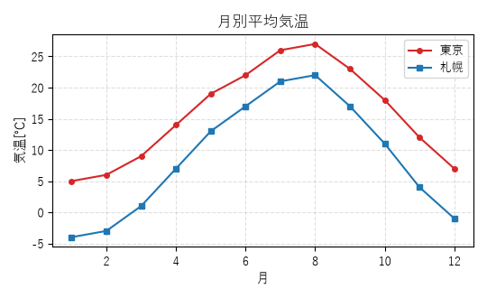

#### 棒

X軸=カテゴリ、Y軸=値。大小比較に。

**入力データ例（先頭4行）**

| 製品 | 売上 |
|---|---|
| A | 120 |
| B | 85 |
| C | 200 |
| D | 150 |


#### 横棒

棒を横向きに。ラベルが長いときに。

**入力データ例（先頭4行）**

| 製品 | 売上 |
|---|---|
| A | 120 |
| B | 85 |
| C | 200 |
| D | 150 |

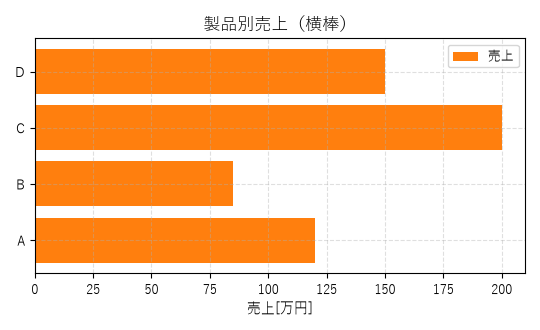

#### 積み上げ棒

複数系列を積み上げ。内訳と合計を同時に。

**入力データ例（先頭4行）**

| 四半期 | 国内 | 海外 |
|---|---|---|
| Q1 | 60 | 40 |
| Q2 | 75 | 55 |
| Q3 | 90 | 70 |
| Q4 | 110 | 95 |

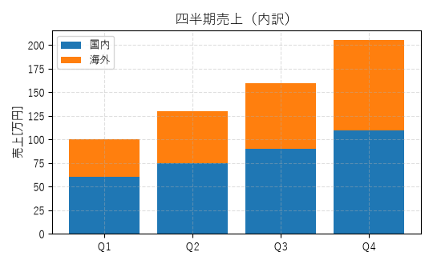

#### 散布図

X-Yの相関を点で。

**入力データ例（先頭4行）**

| 身長 | 体重 |
|---|---|
| 150 | 48.3 |
| 153 | 49.8 |
| 148 | 42.8 |
| 142 | 43.4 |

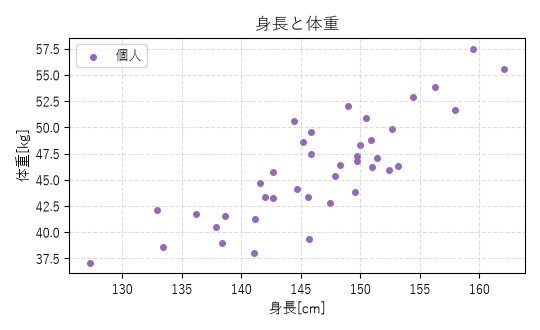

#### ヒストグラム

1列の分布を度数で。ビン数で粒度調整。

**入力データ例（先頭4行）**

| 点数 |
|---|
| 56 |
| 57 |
| 67 |
| 60 |

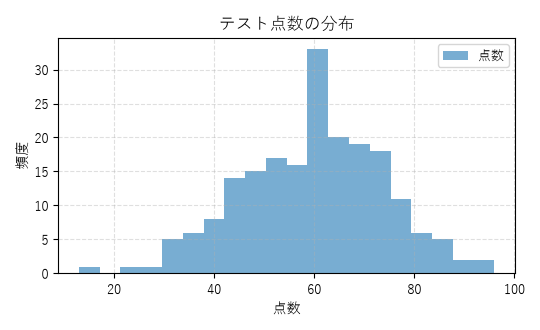

#### 箱ひげ

複数群の中央値・四分位・外れ値を比較。

**入力データ例（先頭4行）**

| A組 | B組 | C組 |
|---|---|---|
| 65.8 | 71.5 | 63.6 |
| 54.2 | 79 | 67.7 |
| 62.3 | 68.9 | 87.3 |
| 63.2 | 70.2 | 57.2 |

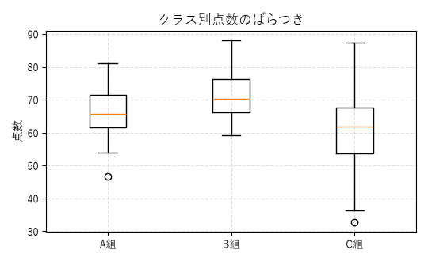

#### 円

構成比を扇形で。％表示可。

**入力データ例（先頭4行）**

| OS | シェア |
|---|---|
| Windows | 62 |
| macOS | 18 |
| Linux | 12 |
| その他 | 8 |

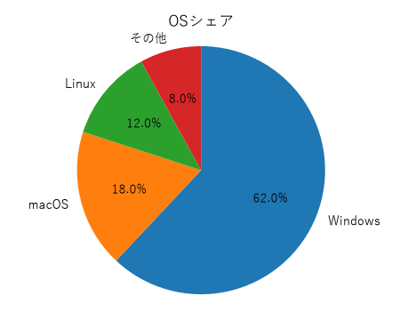

### 追加機能の例（Excel相当の編集）

#### 近似曲線

散布図に回帰直線と数式・R²を凡例表示。

**入力データ例（先頭4行）**

| 身長 | 体重 |
|---|---|
| 150 | 48.3 |
| 153 | 49.8 |
| 148 | 42.8 |
| 142 | 43.4 |

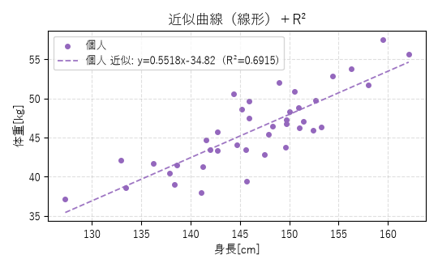

#### データラベル

各棒・各点に値を表示。

**入力データ例（先頭4行）**

| 製品 | 売上 |
|---|---|
| A | 120 |
| B | 85 |
| C | 200 |
| D | 150 |

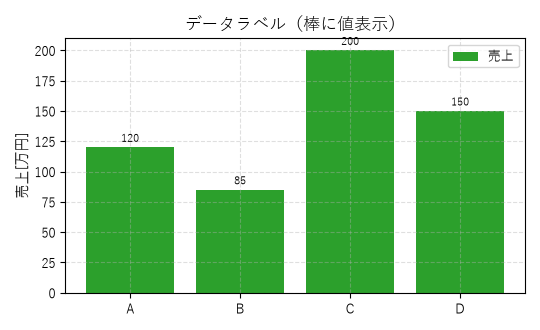

#### 第2軸・複合グラフ

単位の違う2値を左右の軸＋棒/線混在で1枚に。

**入力データ例（先頭4行）**

| 時刻 | 電力 | 気温 |
|---|---|---|
| 0 | 80 | 16 |
| 2 | 70 | 15 |
| 4 | 95 | 18 |
| 6 | 160 | 23 |

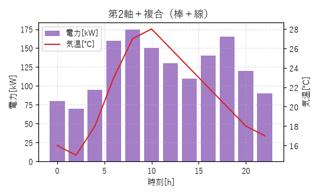

#### エラーバー

誤差列を指定して縦のエラーバーを表示。

**入力データ例（先頭4行）**

| 温度 | 抵抗 | 誤差 |
|---|---|---|
| 0 | 100 | 2 |
| 10 | 104 | 2.5 |
| 20 | 109 | 3 |
| 30 | 113 | 3.2 |

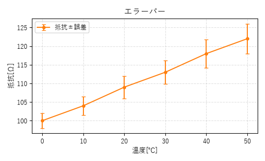

---

## 実例・チュートリアル

ここでは、実際の操作をそのままなぞって試せる実例を集めました。各実例は「目的 → 手順 → 期待される結果」の順に並んでいます。いずれも同梱の `サンプルデータ` フォルダのファイルだけで再現できます。上から順に進めると、読み込み・作図・編集・波形測定・周波数解析・プロトコル解読・設定保存・大容量表示までを一通り体験できます。

> 共通の前提: アプリは `起動.bat` をダブルクリックして起動済みとします。左パネルのタブは左から `1. データ` / `2. オシロ/解析` / `3. 高度解析` / `4. データサイエンス` の順に並び、グラフの書式（種別・タイトル・スタイルなど）は画面右側の `グラフ書式パネル` で設定します。

---

### 実例1: 二軸の複合グラフ（棒＋線）を作る

**目的**: 1つのファイルにある単位の違う2つの値（例: 電力と気温）を、棒グラフと折れ線グラフを混在させ、左右2本のY軸で1枚に重ねて表示します。

**手順**

1. `1. データ` タブを開き、`ファイル追加...`（`Ctrl+O`）を押して `サンプルデータ\Excel編集デモ.csv` を読み込む。
2. `X軸（横軸 / ラベル）` のコンボボックスで `時刻[h]` の列を選ぶ。
3. `Y軸（値）` のチェックリストで `電力[kW]` と `気温[℃]` の2つの系列にチェックを入れる。
4. 画面右側の `グラフ書式パネル` で `グラフ種別` を既定の `折れ線` のままにする。
5. `系列スタイル` 表で、`電力[kW]` の行の `種別` 列を `棒` に、`気温[℃]` の行の `種別` 列を `折れ線` に設定する。
6. 同じ `系列スタイル` 表で、`気温[℃]` の行の `軸` 列を `第2軸` に切り替える（右側にY軸が生成され、`気温[℃]` が第2軸ラベルになる）。
7. `タイトル` に「電力と気温」、`Y軸名` に「電力」と入力する。
8. `グラフを描画 (F5)` を押す（または `F5` キー）。

**期待される結果**: 電力が棒グラフ、気温が折れ線グラフとして1枚に重なって表示されます。左側Y軸が電力（主軸）、右側Y軸が気温（第2軸）となり、それぞれのスケールで読み取れます。`リアルタイム更新（変更を即反映）` がONなら、`種別` や `軸` の変更は描画ボタンを押さなくても自動反映されます。

---

### 実例2: 散布図に近似曲線とR²を出す

**目的**: 2列のデータの相関を散布図で確認し、近似直線（または多項式）と決定係数 R² を凡例に表示します。

**手順**

1. `1. データ` タブで `サンプルデータ\Excel編集デモ.csv` を読み込む（実例1から続ける場合は読み込み済み）。
2. `X軸（横軸 / ラベル）` で `気温[℃]` の列を選ぶ。
3. `Y軸（値）` のチェックリストで `電力[kW]` にチェックを入れる。
4. 画面右側の `グラフ書式パネル` の `グラフ種別` で `散布図` を選ぶ。
5. `系列スタイル` 表の `マーカー` 列で `丸` を選び、各データ点に記号を付ける。
6. `近似曲線` を `線形(y=ax+b)` に設定する。多項式で当てたい場合は `多項式` を選び、`次数` を `2` などにする。
7. `数式/R²` のチェックをONにする（既定でON）。
8. `グラフを描画 (F5)` を押す。

**期待される結果**: 散布点に系列色の破線で近似曲線が重なります。凡例に近似式（例: `y=ax+b` の形）と R²（小数4桁）が表示されます。近似曲線は数値Xのときだけ有効で、棒グラフは対象外です。

---

### 実例3: データをセル編集してCSV保存する

**目的**: 読み込んだ表の値を直接書き換え、不要な行を削除し、編集後の全行を新しいCSVとして保存します。

**手順**

1. `1. データ` タブで `ファイル追加...`（`Ctrl+O`）から `サンプルデータ\波形_減衰振動.csv` を読み込む（ウィンドウへのドラッグ&ドロップでも可）。`X軸（横軸 / ラベル）` で時間の列、`Y軸（値）` で波形の列にチェックを入れ、`グラフを描画 (F5)` を押すと `折れ線` グラフが表示される。
2. 中央下 `データ編集（選択中ファイル・先頭100行）` のバーで `編集可` にチェックを入れる。
3. 表の中のセルをクリックし、値を直接書き換える。数値列に入れた値は数値化され、変換できない文字を入れると空欄（NaN）になる。
4. 不要な行を表で選び（複数選択可）、`行削除` を押して取り除く。変更はグラフにも即反映される。
5. 列を増やしたい場合は `列追加` を押し、列名を入力する（その名前の数値列が `0.0` で初期化され追加される）。
6. `CSV保存` を押し、保存ダイアログでファイル名に `.csv` を付けて保存する。

**期待される結果**: プレビューに見えるのは先頭100行ですが、編集・行削除・保存はすべて全行が対象です。`.csv` で保存するとカンマ区切り・文字コード `utf-8-sig` で書き出されます（`.tsv` で保存した場合はタブ区切り）。

---

### 実例4: オシロのカーソルで立ち上がり時間などを測る

**目的**: 波形をオシロスコープ風に表示し、自動測定で立上り時間などを読み取りつつ、カーソルでエッジ間の時間を直接測ります。

**手順**

1. `1. データ` タブで `サンプルデータ\機能デモ\ピーク_ノイズ込み.csv` を読み込み、`Y軸（値）` で測定したい波形の系列にチェックを入れる。
2. `グラフを描画 (F5)` で折れ線として一度描画しておく（オシロ表示は折れ線/散布図のときだけ有効）。
3. `2. オシロ/解析` タブを開く。
4. 最上部の `オシロスコープ表示（折れ線/散布図）` をONにする。
5. `自動スケール（解析対象に合わせる）` ボタンを押し、波形を画面に収める（`time/div`・`V/div`・X中心・Y中心が自動設定される）。
6. `解析対象:` で測定したい波形の系列を選ぶ。
7. ノイズで偽ピークが出ないよう `平滑化(点):` を `5` にする。
8. `解析実行` を押す。
9. `測定値` 表で `立上り時間 (10-90%)[s]` や `立下り時間 (90-10%)[s]`、`オーバーシュート[%]` などを確認する。
10. エッジ間の時間を直接測るには `カーソル測定` をONにし、グラフを2回クリックして縦カーソルを2本立てる。立上りと立下りのエッジを順にクリックすると、画面上部に Δt・ΔV・1/Δt[Hz] が表示される。

**期待される結果**: `測定値` 表に立上り時間・立下り時間・オーバーシュートなどが単位付きで並びます（算出不能な項目はハイフン）。カーソル測定では2本の縦線の間の時間差 Δt と電圧差 ΔV、その逆数 1/Δt[Hz] が画面上部に出ます。カーソル線は近接8px以内でドラッグして微調整でき、3本目のクリックでリセットされます。

---

### 実例5: FFTでTHD/SNRを測る

**目的**: 高調波歪みを含む波形について、FFTスペクトルを確認し、THD・SNR・ENOB などのスペクトル指標を計算します。

**手順**

1. `1. データ` タブで `サンプルデータ\機能デモ\FFT_高調波THD.csv` を読み込み、`Y軸（値）` で対象の波形にチェックを入れる。
2. `グラフを描画 (F5)` で折れ線として描画しておく。
3. `2. オシロ/解析` タブを開き、`解析対象:` で対象の波形系列を選ぶ。
4. `FFTスペクトル表示` を押し、スペクトルと第Nピーク（周波数[Hz]）を確認する。
5. `3. 高度解析` タブを開く。`FFT 詳細（窓・dB・THD/SNR・スペクトログラム）` ブロックの `窓関数` で `hann`（既定）を選ぶ。
6. `THD/SNR等を計算` を押す。

**期待される結果**: `FFTスペクトル表示` でピーク表が周波数[Hz]に切り替わり、第1ピーク（基本波）が確認できます。`THD/SNR等を計算` を押すと、直下の `指標 / 値` の2列表に `基本波 f0[Hz]`・`THD[%]`・`THD[dB]`・`SNR[dB]`・`SINAD[dB]`・`ENOB[bit]`・`SFDR[dB]` が有効4桁＋単位で表示されます（算出できない項目は `-`）。`解析対象` が未選択だと情報ダイアログが出るので、手順3で必ず選んでおきます。

---

### 実例6: UARTをデコードする

**目的**: UART信号の波形から通信バイト列をデコードし、ASCII文字として読み取ります。

**手順**

1. `1. データ` タブで `サンプルデータ\機能デモ\プロトコル_UART.csv` を読み込み、信号線のY系列にチェックを入れる。
2. `3. 高度解析` タブを開く。
3. `シリアルプロトコル解読` ブロックの `プロトコル` で `UART` を選ぶ。
4. 表示された `Ch1`（ラベルは `信号線`）に、手順1でチェックしたY系列を割り当てる。
5. `ボーレート` に `115200` を入力する（このサンプルの設定。既定も `115200`）。
6. `解読` を押す。

**期待される結果**: 下の4列表 `時刻 / 種別 / 値(hex) / 備考` に、各バイトが時刻（ms）・種別 `data`・`値(hex)`・備考のASCII文字で一覧表示されます。ASCIIに変換できない文字には `⚠` が付きます。UARTの既定は 8bit・パリティなし・ストップ1・LSBファーストです。

> 参考: I2C を試す場合は `プロトコル` で `I2C` を選び、`Ch1`（`SCL`）と `Ch2`（`SDA`）にそれぞれの信号を割り当てます（ボーレートは `不使用`）。種別は `START` / `STOP` / `addr` / `data` で、備考に R/W・ACK/NACK が出ます。

---

### 実例7: 設定を保存して再現する

**目的**: 整えたグラフ・解析・表示の設定一式をJSONに保存し、次回そのまま復元できるようにします。

**手順**

1. これまでの実例のいずれかでグラフや解析の設定を一通り整える。
2. メニュー `ファイル(F)` → `設定を保存...`（`Ctrl+Shift+S`）を選ぶ。
3. ファイルダイアログで保存先フォルダを選ぶ（前回使ったフォルダが初期表示される）。
4. ファイル名は既定の `graph_config.json` のまま保存ボタンを押す。
5. ステータスバーに『設定を保存: パス』と表示されれば完了。
6. 復元するには、メニュー `ファイル(F)` → `設定を読み込み...` を選び、保存した `*.json` を開く。

**期待される結果**: 保存したJSONには、開いているファイル一覧・X軸列・選択中Y系列・グラフ種別・タイトル/軸名・文字サイズ・グリッド/凡例/凡例位置・X/Y範囲とX/Y対数・ヒストグラムのビン数・近似（トレンド）設定・データラベル・出力DPI/透過・最近使ったファイル・系列スタイル・オシロ設定・ピーク数N などが保存されます（UTF-8・インデント2）。`設定を読み込み...` を実行すると列の復元と各UIへの反映が行われ、自動で再描画されます。設定内に記録されたデータファイルが存在すれば、自動で再オープンして系列選択まで復元され、ステータスバーに『設定を読み込み: パス』と表示されます。

> 補足: メニュー操作をしなくても、ウィンドウを閉じると現在の全設定が `~/.csv_graph_tool/last_session.json` に自動保存され、次回起動時に自動で復元されます（前回ファイルが1つ以上記録されている場合のみ）。

---

### 実例8: 大容量波形をデシメーション表示する

**目的**: 約50万点ある大容量波形を、見た目を保ったまま間引いて高速に表示し、ズーム時に自動で再サンプルさせます。

**手順**

1. `1. データ` タブで `サンプルデータ\波形_負荷テスト_500k.csv`（約50万点）を読み込む。
2. タブ下部の `大容量データを間引き表示（高速・ズームで自動再サンプル）` がONになっていることを確認する（既定オン）。
3. 大容量データでは再描画が重くなるため、`リアルタイム更新（変更を即反映）` はOFFにしておくことを推奨。
4. `X軸（横軸 / ラベル）` で時間の列を選び、`Y軸（値）` で波形の系列にチェックを入れる。
5. `グラフを描画 (F5)` を押す。
6. グラフ表示エリア上部の matplotlib ナビゲーションツールバーで拡大（ズーム）操作をして、表示範囲を狭める。

**期待される結果**: 折れ線が見た目を保ったまま間引かれて高速に描画され、ステータスに『(N点を間引き表示)』と表示されます。ズームすると表示範囲に応じて自動で再サンプルされ、拡大した範囲では細部がより細かく描かれます。間引き対象は折れ線／散布図です。

---

## 付録：困ったとき / よくある質問

| 症状 | 対処 |
| --- | --- |
| タイトルや軸の日本語が □□□ になる | 日本語フォント未検出。ステータスバー右端が「日本語フォント未検出」のときは、OSに日本語フォント（例: Yu Gothic / Meiryo）が必要です。 |
| 文字が化ける（例: 縺ゅ→…） | `1. データ` タブの `文字コード:` を `cp932` 等へ手動指定し `選択中ファイルを再読込`。 |
| 区切りがうまく分かれない | `区切り:` を手動指定して再読込。 |
| Shift+ホイールでV/divが変わらない | グラフを一度クリックしてフォーカスを与えてから操作。 |
| 大量データで重い | `1. データ` タブの間引き表示をON、`リアルタイム更新` をOFF。 |
| グラフの縦横比を変えたい | `グラフ書式パネル` の `縦横比` で `16:9` / `4:3` / `1:1` / `A4横` 等を選ぶ（`カスタム` でW:H指定可）。画面・画像出力の両方に反映。`自動` はウィンドウ追従。ウィンドウ角を引くと縦横が同時に変わるため比率は保たれます（比率だけ変えるにはパネル間の仕切り線を引くか、この `縦横比` を使用）。 |
| 起動しない | 先に `セットアップ.bat` を1回実行。仮想環境 `C:\.venv` が必要です。 |

---

*この説明書はソースコード（graph_app.py / plotter.py / analysis.py / mathchan.py / advanced.py / datasci.py / data_loader.py / config_io.py）に基づいて作成されています。*
